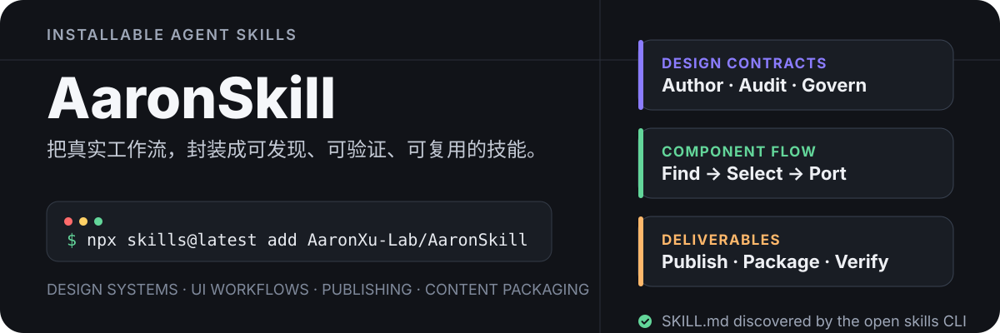

<p align="center">
  
</p>

<p align="center">
  <strong>把真实工作流封装成可发现、可验证、可复用的 Agent Skills。</strong>
</p>

<p align="center">
  设计系统 · UI/UX · 品牌资产 · Figma 工具 · Skill 工程 · 内容工作流
</p>

## 一条命令安装

```bash
npx skills@latest add AaronXu-Lab/AaronSkill
```

安装器会发现仓库中所有包含 `SKILL.md` 的技能，并让你选择需要安装的项目。只查看可用技能：

```bash
npx skills@latest add AaronXu-Lab/AaronSkill --list
```

安装单个技能：

```bash
npx skills@latest add AaronXu-Lab/AaronSkill \
  --skill aw-find-and-port-ui-component
```

全局安装到 Codex：

```bash
npx skills@latest add AaronXu-Lab/AaronSkill \
  --skill aw-find-and-port-ui-component \
  --agent codex \
  --global
```

> `skills` CLI 默认在项目范围安装；添加 `--global` 可供所有项目使用。交互式安装默认推荐软链，使用 `--copy` 才会创建独立副本。

## Skills

目前共收录 **15 个 Skill**，按主要用途分为元 Skill、工具类、资源获取、设计支撑和设计 Agent；另单独标记不再维护的 Skill。

### 元 Skill

用于创建、升级和规范化其他 Skill 的元能力。

| Skill | 版本 | 它解决什么问题 | 关键边界 |
| --- | --- | --- | --- |
| [`aw-meta-skill`](./aw-meta-skill/) | `1.4.0` | 基于 `skill-creator` 创建或更新符合 AW 交付规范的 Skill | Markdown 可用 Mermaid 精确表达复杂流程；SVG 保留人类理解所需的关键结构 |

### 工具类

面向明确输入与结果的实用工作流，帮助完成资产加工、内容处理或专项工程任务。

| Skill | 版本 | 它解决什么问题 | 关键边界 |
| --- | --- | --- | --- |
| [`aw-logo-asset-cook`](./aw-logo-asset-cook/) | `1.1.0` | 从唯一 SVG 事实源生成并验证 Web、桌面端与移动端全平台图标资源 | 必须由用户明确指定源文件或目录；单主题补色与清理产物前需要授权 |
| [`aw-mail-read-later`](./aw-mail-read-later/) | `1.0.2` | 从 Outlook 的 `Read Later` 文件夹推荐、阅读、总结或翻译一项内容 | 手动一次处理一项；归档或移除邮件前必须得到用户确认 |
| [`rewrite-like-aaron`](./rewrite-like-aaron/) | `1.0.3` | 将 AI 中文草稿改写为 Aaron 当前的博客文风 | 保留事实与立场；限制口头禅、反问和中英混写的表面模仿 |

### 资源获取

负责从外部来源检索、验证、筛选并整理可用资源。

| Skill | 版本 | 它解决什么问题 | 关键边界 |
| --- | --- | --- | --- |
| [`aw-comic-dossier-packer`](./aw-comic-dossier-packer/) | `1.0.3` | 收集漫画封面、整理来源介绍、生成小红书封面与最终档案 | 高清化需确认费用；社媒图使用原创视觉而非复刻封面 |
| [`aw-logo-finder`](./aw-logo-finder/) | `1.0.3` | 从官网、Logo 资源站和应用商店寻找、比对并导出品牌或产品 Logo | 必须先确认候选与输出尺寸，再生成无损 WebP |

### 设计 · 支撑

为设计系统、组件实现和设计交付提供基础设施、规范与工程支撑。

| Skill | 版本 | 它解决什么问题 | 关键边界 |
| --- | --- | --- | --- |
| [`aw-design-md-author`](./aw-design-md-author/) | `1.1.2` | 按 Google Labs 规范创建、审查和维护完整的 `DESIGN.md` 视觉契约 | 必须完成官方 lint；不代替代码或 Figma |
| [`aw-design-system-gallery`](./aw-design-system-gallery/) | `3.16.0` | 审查或优化 Gallery 的默认示例、真实设计轴与状态对比 | 纯健壮性验证不默认进入正式 Gallery；明确要求或正式设计契约按范围处理；复合展示不替代子级矩阵；技术 wrapper 视觉不可见；Caption 仅含真实公开轴；边界提示接入现有开关并验证两态；项目配置留在目标仓库 |
| [`aw-design-fake`](./aw-design-fake/) | `1.3.0` | 为原型工程统一 fake 数据、演示源码与占位交互，并初始化或同步 bundle | 源码逐字复用、仅展示不执行；仅源码展示可沿用已有 fixture；不碰单测 mock 与真实契约 |
| [`aw-design-token-consistency-auditor`](./aw-design-token-consistency-auditor/) | `0.8.0` | 比较 Figma Variables、`DESIGN.md` 和 CSS/Less Token | 只生成审计证据，不自动改写 Token |
| [`aw-find-and-port-ui-component`](./aw-find-and-port-ui-component/) | `1.0.4` | 搜索、验证并移植 UI 组件实现 | Find 与 Port 严格分阶段，必须由用户明确选择 |

### 设计 · Agent

直接参与界面判断、审查和表达质量控制的设计 Agent。

| Skill | 版本 | 它解决什么问题 | 关键边界 |
| --- | --- | --- | --- |
| [`aw-ux-info-redundancy-audit`](./aw-ux-info-redundancy-audit/) | `1.4.0` | 审计各类 UI/UX 的信息任务价值、语义重复、适用阶段与视觉承载物必要性 | 先输出审计证据与最小改动决策，再实施界面修改 |
| [`aw-wording-reviewer`](./aw-wording-reviewer/) | `0.8.1` | 审查简体中文 UI 的排版、术语、格式、跨组件数据展示与微文案 | 默认只审查不修改；不用于英文、日文或产品信息架构评审 |
| [`temp-small-improves`](./temp-small-improves/) | `1.0.0` | 显式检查并优化一组容易遗漏的界面排版、控件与动效细节 | 仅用户主动点名时调用；只处理有证据支持的最小改动 |

### 不再维护

以下 Skill 保留在仓库中供已有使用者参考，但不再主动演进或纳入新能力建设。

| Skill | 版本 | 状态 |
| --- | --- | --- |
| [`aw-figma-component-governance`](./aw-figma-component-governance/) | `0.9.0` | 不再维护 |

## 这些 Skill 如何工作

```text
真实需求
   │
   ├─ 读取项目、来源与环境约束
   │
   ├─ 执行窄范围、可追溯的工作流
   │
   ├─ 在高风险或高成本动作前停下确认
   │
   └─ 用 lint、结构化报告或结果回读完成验证
```

仓库里的 Skill 倾向于把脆弱、重复的步骤放进 `scripts/`，把规则和 schema 放进 `references/`，并让 `SKILL.md` 保持为清晰的执行入口。

## 仓库结构

```text
<skill-name>/
├── SKILL.md              # 触发说明与完整工作流
├── scripts/              # 可重复执行的确定性工具（按需）
├── references/           # schema、规范与运行手册（按需）
└── fixtures / graders    # 评测资产（按需）
```

`skills` CLI 会递归发现仓库中的 `SKILL.md`，因此每个一级目录都可以作为独立技能安装。

## 使用前先看依赖

每个 Skill 的依赖不同。调用前请阅读对应 `SKILL.md`：

- Figma 等外部工具流程需要对应应用、权限或授权状态。
- 图片高清化需要 Gemini API Key，并可能产生 API 费用。
- 网页检索、GitHub 源码验证和远程发布需要网络访问。
- 标注为 optional 的 Skill 缺失时应降级执行，而不是伪造能力。

## 开发与验证

修改 Skill 后，至少检查 frontmatter 与目录结构：

```bash
python /path/to/skill-creator/scripts/quick_validate.py ./<skill-name>
```

如果 Skill 自带脚本、测试或 grader，还应运行对应验证。不要把成功加载 `SKILL.md` 当作工作流已经通过验证。

## 更新

通过 `skills` CLI 安装后，可以更新全部或指定 Skill：

```bash
npx skills@latest update
npx skills@latest update aw-find-and-port-ui-component
```

更多安装选项参见 [`skills` CLI](https://github.com/vercel-labs/skills)。
