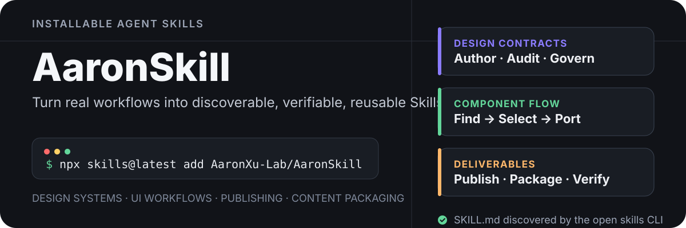

<p align="center">
  <a href="./README.zh-CN.md">中文 README</a> · <strong>English</strong>
</p>

<p align="center">
  
</p>

<p align="center">
  <strong>Turn real workflows into discoverable, verifiable, reusable Agent Skills.</strong>
</p>

<p align="center">
  Design systems · UI/UX · brand assets · Figma tools · Skill engineering · content workflows
</p>

## Install in one command

```bash
npx skills@latest add AaronXu-Lab/AaronSkill
```

The installer discovers every Skill in the repository that contains a `SKILL.md` and lets you choose which ones to install. To list the available Skills without installing them:

```bash
npx skills@latest add AaronXu-Lab/AaronSkill --list
```

Install one Skill:

```bash
npx skills@latest add AaronXu-Lab/AaronSkill \
  --skill aw-find-and-port-ui-component
```

Install globally for Codex:

```bash
npx skills@latest add AaronXu-Lab/AaronSkill \
  --skill aw-find-and-port-ui-component \
  --agent codex \
  --global
```

> The `skills` CLI installs to the current project by default. Add `--global` to use a Skill across projects. Interactive installation recommends symlinks; use `--copy` to create a standalone copy.

## Skills

### Install local repository symlinks

Run this from the repository to check all first-level Skill directories and create any missing symlinks in `~/.agents/skills`. This includes the Working On and no-longer-maintained Skills.

On macOS, you can also double-click `link-skills.command` in the repository root, then press Return to close the results window when it finishes.

```bash
python3 link-skills.py
```

The script locates the repository relative to itself, so it can run from any working directory. Re-running it skips correct symlinks. It preserves and reports conflicting same-name files, directories, or symlinks that point elsewhere, and exits with code `1`.

Preview changes without writing, or choose another global directory:

```bash
python3 link-skills.py --dry-run
python3 link-skills.py --target ~/.codex/skills
```

The repository currently contains **16 Skills**, grouped by primary purpose into meta Skills, tools, resource discovery, and design support. It also has a Working On group and a separate list of no-longer-maintained Skills.

### Meta Skill

Capabilities for creating, upgrading, and standardizing other Skills.

| Skill | Version | What it does | Key boundaries |
| --- | --- | --- | --- |
| [`aw-meta-skill`](./aw-meta-skill/) | `1.9.1` | Creates or updates any Skill, serving as the unified entry point in place of `skill-creator` | Reads and validates according to the change scope; Markdown is the source of truth, and SVG details are loaded as needed |

### Tools

Reusable workflows for well-defined inputs and outputs, including asset processing, content handling, and focused engineering tasks.

| Skill | Version | What it does | Key boundaries |
| --- | --- | --- | --- |
| [`aw-logo-asset-cook`](./aw-logo-asset-cook/) | `1.3.1` | Creates and validates cross-platform icon assets from SVGs or images that have been assessed and iteratively redrawn | Requires user-specified input; confirm low-fidelity conversions, and check compatibility and themes after a redraw is approved |
| [`aw-mail-read-later`](./aw-mail-read-later/) | `1.1.1` | Recommends, reads, summarizes, or translates one item from Outlook's `Read Later` folder | Handles one item per manual run; requires confirmation before archiving or removing an email |
| [`aw-tiered-task-dispatch`](./aw-tiered-task-dispatch/) | `1.7.0` | Handles read-only research in the main session and dispatches implementation work in Codex or Claude based on remaining uncertainty, impact, and coordination complexity | Uses the lower tier for settled, local work and the middle tier for substantive design or coordination; clarifies key plans first and treats history only as a weighting signal; resolves the latest available model by series, with user choice taking priority; execution sessions validate independently and do not communicate with each other |
| [`rewrite-like-aaron`](./rewrite-like-aaron/) | `1.1.1` | Rewrites AI-generated Chinese drafts in Aaron's current blog voice | Preserves facts and positions; limits catchphrases, rhetorical questions, and surface-level imitation through Chinese-English mixing |

### Resource discovery

Finds, verifies, filters, and organizes useful resources from external sources.

| Skill | Version | What it does | Key boundaries |
| --- | --- | --- | --- |
| [`aw-comic-dossier-packer`](./aw-comic-dossier-packer/) | `1.1.0` | Collects comic covers, source information, Xiaohongshu covers, and a final dossier | Confirm costs before upscaling; use original visuals rather than reproducing covers in social media graphics |
| [`aw-logo-finder`](./aw-logo-finder/) | `1.1.0` | Finds, compares, and exports brand or product logos from official sites, logo directories, and app stores | Confirm candidates and output dimensions before generating lossless WebP files |

### Design support

Infrastructure, standards, and engineering support for design systems, component implementation, and design delivery.

| Skill | Version | What it does | Key boundaries |
| --- | --- | --- | --- |
| [`aw-design-md-author`](./aw-design-md-author/) | `1.7.0` | Creates, reviews, and maintains complete `DESIGN.md` visual contracts following Google Labs conventions | Protects ownership and comment-only boundaries; reports when official validation is unavailable; does not replace code or Figma |
| [`aw-design-system-gallery`](./aw-design-system-gallery/) | `4.1.0` | Creates, reviews, or improves Gallery default examples, real design axes, and state comparisons | Reuses the local standard structure and documentation layout for component panels; Playground and Properties share axis order, values, and dependency-based disabling; Reset includes theme overrides; section links use path routing and in-page anchors; robustness-only checks do not enter the production Gallery by default; composite examples do not replace child matrices; captions show only real public axes; boundary hints use the existing toggle and both states are verified; project configuration stays in the target repository |
| [`aw-design-fake`](./aw-design-fake/) | `1.8.1` | Unifies fake data, demo source code, and placeholder interactions in prototype projects, and initializes or syncs bundles | Prioritizes real contract data and states; demo scenarios must be explicitly escapable and isolate writes; source code is reused verbatim and displayed without execution; does not touch unit-test mocks |
| [`aw-design-token-consistency-auditor`](./aw-design-token-consistency-auditor/) | `0.9.0` | Compares Figma Variables, `DESIGN.md`, and CSS/Less tokens | Produces audit evidence only and does not rewrite tokens automatically |
| [`aw-find-and-port-ui-component`](./aw-find-and-port-ui-component/) | `2.2.1` | Finds and compares specific components from Base UI and other React sources, including Lobe UI, then adapts them for Base UI and CSS Modules | Handles component-level requests only; Find verifies the exact source and license, then waits for a selection; Port confirms details lost or dependencies added in advance |

### Working On

Skills under active development, each kept in its own directory for optional installation and use.

| Skill | Version | What it does | Key boundaries |
| --- | --- | --- | --- |
| [`temp-local-service-doctor`](./temp-local-service-doctor/) | `1.1.1` | Starts local multi-service projects and diagnoses port, API, and page-loading failures | Prefers existing entry points; confirms process ownership; verifies through call paths and the target page |
| [`temp-prd-verifier`](./temp-prd-verifier/) | `1.1.1` | Verifies requirements against a project PRD and, when needed, compares them with the interface or implementation | Separates explicit requirements, inferences, and gaps; performs read-only checks or fixes within existing authorization |
| [`temp-small-improves`](./temp-small-improves/) | `1.2.0` | Sequentially checks 66 small UI improvements across interface details, motion, typography, colors, accessibility, layout, and wording | Runs only when explicitly named; merges overlapping checks and makes the smallest evidence-based changes |

### No longer maintained

These Skills remain in the repository for existing users, but are no longer actively developed or considered for new capabilities.

| Skill | Version | Status |
| --- | --- | --- |
| [`aw-figma-component-governance`](./aw-figma-component-governance/) | `0.10.0` | No longer maintained |

## How these Skills work

```text
Real request
   │
   ├─ Read project, source, and environment constraints
   │
   ├─ Follow a narrow, traceable workflow
   │
   ├─ Pause for confirmation before high-risk or costly actions
   │
   └─ Verify with linting, structured reports, or read-back
```

Skills in this repository put fragile, repetitive steps in `scripts/`, keep rules and schemas in `references/`, and use `SKILL.md` as a clear entry point for execution.

## Repository structure

```text
<skill-name>/
├── SKILL.md              # Trigger guidance and complete workflow
├── scripts/              # Repeatable, deterministic tools (optional)
├── references/           # Schemas, standards, and runbooks (optional)
└── fixtures / graders    # Evaluation assets (optional)
```

The `skills` CLI recursively discovers `SKILL.md` files, so every first-level directory can be installed as an independent Skill.

## Check dependencies before use

The eight design agents are maintained in [Design-Agent](https://github.com/AaronXu-Lab/Design-Agent) and installed separately. Its workflow entry is `aw-design-orchestrator`; `aw-component-advisor` provides guidance/audit using the manually started [AaronUI-Web knowledge MCP](https://github.com/AaronXu-Lab/AaronUI-Web/tree/main/mcp). Only `component/dialog` is covered in this iteration; Gallery displays more components. The old `aw-component-checker` is a deprecated redirect with no component-rule fallback. Design support and `aw-meta-skill` remain in this repository.

Dependencies vary by Skill. Read the relevant `SKILL.md` before invoking one:

- Workflows that use Figma or other external tools require the relevant app, permissions, or authorization.
- Image upscaling requires a Gemini API key and may incur API charges.
- Web research, GitHub source verification, and remote publishing require network access.
- If an optional Skill is unavailable, use a fallback instead of claiming capabilities you do not have.

## Development and validation

After modifying a Skill, at minimum check its frontmatter and directory structure:

```bash
python /path/to/skill-creator/scripts/quick_validate.py ./<skill-name>
```

If the Skill includes scripts, tests, or graders, run the relevant checks too. Successfully loading `SKILL.md` does not mean its workflow has been validated.

## Updates

After installing with the `skills` CLI, update all Skills or a specific Skill:

```bash
npx skills@latest update
npx skills@latest update aw-find-and-port-ui-component
```

See the [`skills` CLI](https://github.com/vercel-labs/skills) for more installation options.
