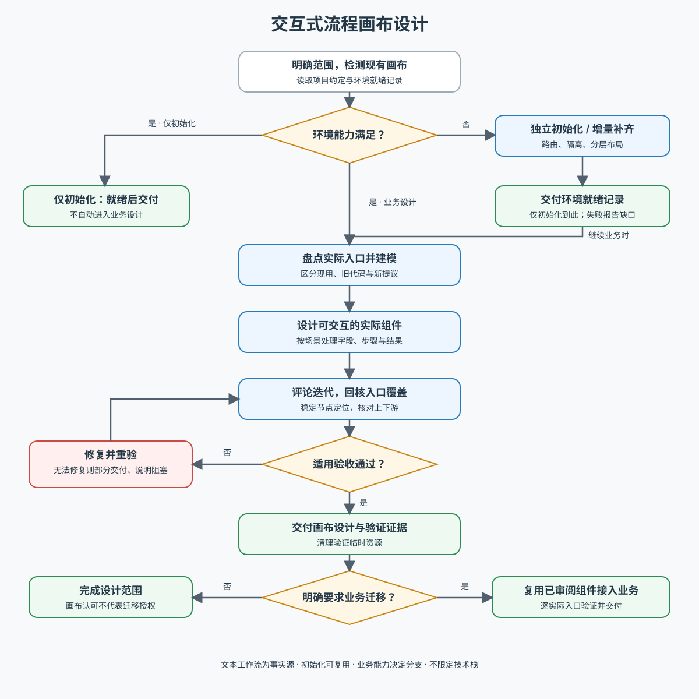

# Canvas Design

将多弹层流程放在同一可操作画布中，直接审阅组件、状态和分支。`/<业务路由>/design-canvas`（如 `/login/design-canvas`）是 Step 1 的设计整理入口，不是业务正式页面；`?preview={name}` 单独查看一条流程。只有用户明确要求应用时，Step 2 才把设计接入实际业务入口。初始化模块只负责可复用承载环境，不在每次迭代时重建画布。

## 执行入口

先读 [执行工作流](references/workflow.md)，按任务选择资料：

| 当前任务 | 读取入口 |
| --- | --- |
| 新建画布或补齐基础设施 | [执行工作流](references/workflow.md#0-前置核实可复用的画布能力)：优先使用项目已有框架和依赖，只为实际缺口引入新依赖；局部修改不因参考版本不同而停下 |
| 只搭建环境，或发现现有能力缺失/失效 | [独立初始化模块](references/initialization.md)：检测复用、依赖与路由、隔离、操作、分层布局与连线精简；产出就绪记录 |
| 新流程或分支变化 | [流程建模](references/modeling.md)：实际入口、可达性、节点与覆盖表 |
| 实现或修改预览组件 | [场景设计](references/component-design.md)：实际组件、字段、滚动、Fake 与条件式步骤 |
| 生成新画布，或调整卡片、目录、视口与图例 | 先复制 [canvas-kit](assets/canvas-kit/) 再填流程数据：视觉以 HTML 标准件为准，逻辑以 `reference/` 为准，有设计系统时用其组件与 token 实现同等效果；规则见 [画布呈现规范](references/canvas-presentation.md) |
| 评论修改或明确要求业务迁移 | [评论与迁移](references/iteration-and-migration.md)：逐项闭环与授权边界 |
| 验收当前改动 | [验收矩阵](references/verification.md)：按影响范围验证并清理临时资源 |

已有画布先核实就绪记录；能力满足则跳过初始化细节，只在缺口处增量补齐。只初始化的请求以环境就绪为出口，不自动进入业务设计。

## 共同约束

优先复用项目已有画布能力、设计系统与实际组件；canvas-kit 的技术栈和版本仅供参考，不强制升级项目依赖。以实际入口和能力证据建模，区分现用、旧代码及新提议。交互预览必须隔离状态和副作用，不能用截图或重复静态 UI 代替。适用时使用可用的 aw-design-fake 和 aw-wording-reviewer，缺失时遵循工作流的降级边界。

画布认可不自动授权业务迁移；明确要求应用后尽量复用已审阅组件接入指定入口。完成本次范围内实现、评论修复与验收，报告未验证项，不默认在第一版停下等待批准。

下图概览初始化复用、设计闭环与迁移门槛，文本工作流为事实源。

