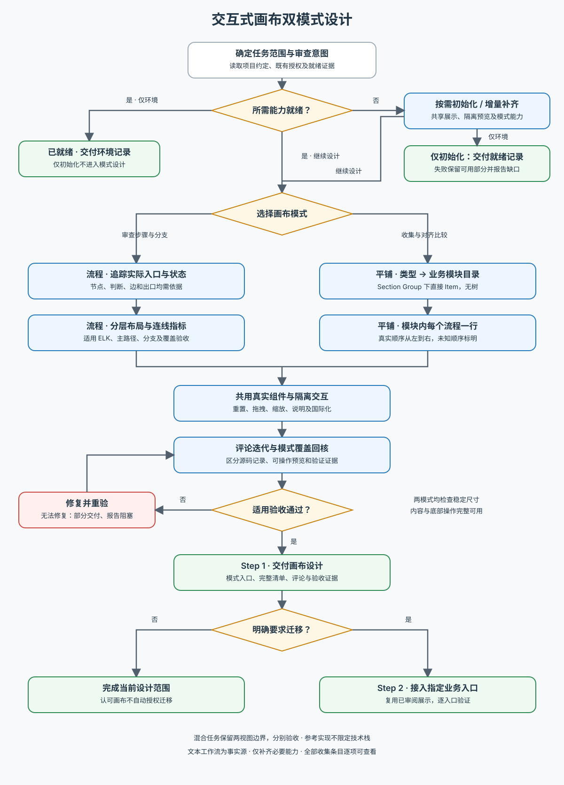

# Canvas Design

在同一可操作画布中审阅真实页面与弹层，按意图选择两种模式：

- **流程模式 `flow`**：查看业务步骤、状态转移和分支；用有依据的节点、判断、连线和出口，采用适用的 ELK 分层布局与连线验收。
- **设计平铺模式 `tiles`**：收集页面、Dialog、Sheet 并对齐比较；用独立条目与场景清单、有序逐行布局和类型 → 业务模块目录，明确源码记录与真实交互预览。不能把它当作空边流程图继续套流程布局，也不虚构关系、入口旗或流程出口。

`/<业务路由>/design-canvas` 是 Step 1 的设计整理入口；流程用 `?preview={name}` 独立走查，平铺可用 `?item={id}` 独立查看条目。混合任务提供边界明确的两种视图，按各自模式验收。初始化即建立与实际页面共用的展示组件，分别注入业务或预览数据与回调；只有明确要求应用时，Step 2 才接入实际业务入口。

## 执行入口

先读 [执行工作流](references/workflow.md)，按任务选择资料：

| 当前任务 | 读取入口 |
| --- | --- |
| 新建画布或补齐基础设施 | [执行工作流](references/workflow.md#0-前置核实可复用的画布能力)：优先使用项目已有框架和依赖，只为实际缺口引入新依赖；局部修改不因参考版本不同而停下 |
| 只搭建环境，或发现现有能力缺失/失效 | [独立初始化模块](references/initialization.md)：检测复用、依赖与路由、隔离、操作、所选模式布局与共用交互；产出就绪记录 |
| 新流程或分支变化 | [流程建模](references/modeling.md)：实际入口、可达性、节点与覆盖表 |
| 收集、对齐或比较页面/弹层 | [平铺建模与比较](references/design-tiling.md)：类型/模块/行/条目模型、完整覆盖、比较尺度与目录规则 |
| 实现或修改预览组件 | [场景设计](references/component-design.md)：实际组件、字段、滚动、Fake 与条件式步骤 |
| 生成新画布，或调整卡片、目录、视口与图例 | 复制 [canvas-kit](assets/canvas-kit/) 的适用模式及共用部分再填数据：视觉以 HTML 标准件为准，逻辑以 `reference/` 为准，有设计系统时用其组件与 token 实现同等效果；规则见 [画布呈现规范](references/canvas-presentation.md) |
| 评论修改或明确要求业务迁移 | [评论与迁移](references/iteration-and-migration.md)：逐项闭环与授权边界 |
| 验收当前改动 | [验收矩阵](references/verification.md)：按影响范围验证并清理临时资源 |

已有画布先核实就绪记录；能力满足则跳过初始化细节，只在缺口处增量补齐。只初始化的请求以环境就绪为出口，不自动进入业务设计。

## 共同约束

优先复用项目已有画布能力、设计系统与实际组件；canvas-kit 的技术栈和版本仅供参考，不强制升级项目依赖。以实际入口、源码来源和能力证据建模，区分现用、旧代码及新提议。画布、独立预览与实际页面必须共用展示组件和样式；初始化按[共享展示契约](references/workflow.md#从初始化建立同一套展示代码)检查引用关系。交互预览必须隔离状态和副作用，不能用截图或重复 UI 代替。平铺全部收集条目均须逐项可查看，源码记录、引用可达、可操作预览和已验证交互分别计数；Dialog/Sheet 使用独立类型 Section Group，下接业务模块 Sidebar Item，不用文件夹或折叠树；模块内每个流程一行，有依据的步骤从左到右排列，未知顺序明确标记，复用项目真实导出。两模式共用重置、拖拽、缩放、说明与项目国际化机制，预览尺寸按真实响应式留白回算并在稳定后验收。适用时使用可用的 aw-design-fake 和 aw-wording-reviewer，缺失时遵循工作流的降级边界。

画布认可不自动授权业务迁移；明确要求应用后将同一已审阅展示组件接入指定入口。完成本次范围内实现、评论修复与验收，报告未验证项，不默认在第一版停下等待批准。

下图概览初始化复用、两种模式、设计闭环与迁移门槛，文本工作流为事实源。

