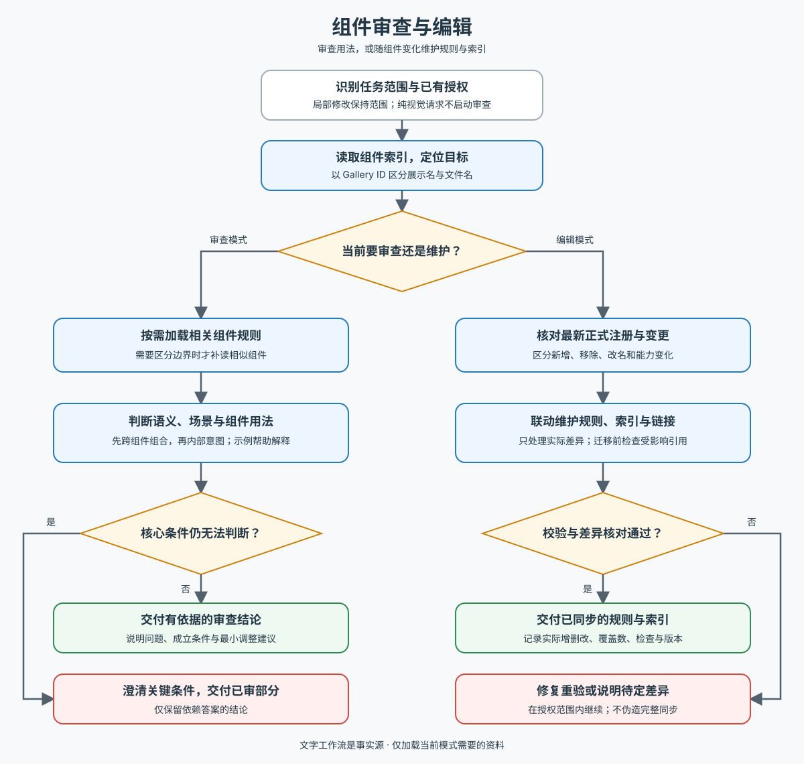

# AW Component Checker

按 [工作流](references/workflow.md) 选择当前任务模式，再读取 [组件索引](references/components/index.md) 定位目标：

- **审查模式**：设计基本完成后，先判断为什么应当使用该组件，再判断当前用法是否一致。只加载涉及的 Reference；需要区分边界时才补读相似组件，不一次加载全库。示例解释判断条件，不限定业务场景。
- **编辑模式**：用户要求更新规则、增删或同步索引时，读取 [编辑工作流](docs/editing.md)。依据当前正式 Gallery 联动维护 Reference、索引和受影响链接，支持新增、移除、改名、分组与能力变化；局部文案请求保持原范围。

组件以稳定 Gallery ID 匹配，展示名与代码目录名不必相同。沿用已有授权，区分事实与待确认条件；纯审查不自动改写规则。

下图是两种模式的概览，具体判断以文字工作流及按需加载的组件规则为准。

