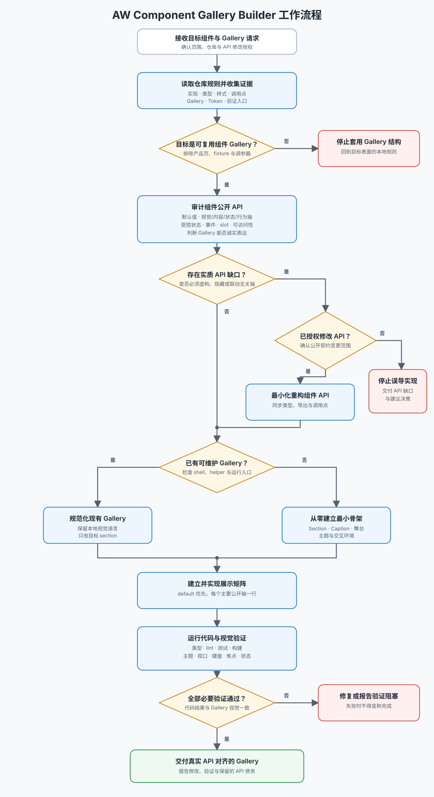

# AW Component Gallery Builder

为可复用组件建立一份可运行的 API 说明书：Gallery 展示真实默认值、主要视觉轴、状态和交互；组件公开 API 则保持语义清楚、正交、可控且适合被展示。Gallery 不是产品 mock，也不能靠虚构 props 掩盖组件设计问题。

执行前读取 [Component Gallery 文本工作流](docs/workflow.md)。它是执行事实源；流程图是同步的视觉投影：

## 范围与授权

- 适用于任何框架或仓库中的可复用 UI Component，以及专门承载这些组件的 Gallery、Story、Demo 或 Showcase 页面。
- 可处理两种模式：规范化已有 Gallery，或从零建立最小可用 Gallery。根据仓库现状选择，不要默认重建。
- 不把本技能的展示结构套到产品路由、业务页面、营销页、fixture、设计调参器或仅供内部诊断的控制面板。
- API 审计始终执行；只有用户请求包含组件实现或 API 修改时，才实际重构组件。若未获授权，记录问题并继续展示仍可被诚实表达的部分。
- 若 Gallery 必须虚构 props、隐藏冲突默认值或伪造确定性才能成立，停止实现并交付 API 缺口报告；不要制作误导性的示例。
- 遵守目标仓库规则、现有框架、设计 Token 和依赖政策。Gallery 工作不自动授权新增依赖或修改真实产品用法。

## 核心判断

1. **Gallery 是 API 的投影。** 先读组件实现、公开类型、样式映射和真实调用点，再写 Caption 或示例。
2. **API 服务于真实组件语义。** 不为了排出整齐矩阵而制造无意义的 `variant`、`size` 或布尔 props。
3. **默认示例是一条完整基线。** 它列出当前示例涉及的主要有效默认值；演示用的初始状态不冒充 API 默认值。
4. **一次只比较一个轴。** 除目标 prop 外，内容、宽度、状态与环境保持一致。
5. **产品语境与展示语境分离。** Gallery 用中性内容；真实调用方保留真实文案、图标、数量和业务类型。

## 执行流程

### 1. 定位目标和证据

读取仓库规则，定位组件实现、公开类型/导出、样式、现有 Gallery 基础设施与代表性调用点。先确认目标是单组件展示、多个组件整理，还是 Gallery 从零建设。

已有成熟展示时，选一个结构清楚的组件区作为**结构参考**，但不复制其组件专属 prop 名。没有成熟展示时，不凭其他项目的目录或框架假设目标结构。

### 2. 审计组件 API

每次都读取 [组件 API 设计约束](references/component-api-design.md)，形成以下事实：

- 组件的常见默认用例；
- 主要视觉轴、内容轴、状态轴和行为轴；
- 每个 prop 的类型、有效默认值和条件关系；
- 受控/非受控状态、事件和可访问性契约；
- 是否存在会让 Gallery 失真的 API 缺口。

轻微命名或结构债务不阻断展示。只有当示例无法真实、确定、互斥地表达 API 时，才视为实质缺口。获准修改时先收敛组件 API 并更新调用点；未获准时停止在缺口处，不擅自改变公开契约。

### 3. 选择 Gallery 模式

- **已有 Gallery：** 保留当地 shell、导航、示例 primitives、状态模式和视觉语言；只整理目标范围。
- **从零建立：** 以当前技术栈建立最小骨架，至少包含稳定的组件 section、Caption、示例舞台/行布局、主题或背景条件（当组件体系支持时）以及可访问的交互。组件数量足以产生查找成本时再加导航或搜索。

不要为了 Gallery 引入完整文档站框架。复用现有构建入口、路由和 Token；新增依赖必须有目标仓库允许且现有技术栈无法合理完成的理由。

### 4. 建立展示矩阵并实现

每个组件先列 `default`，再按一个主要公开轴一行展开。完整展示规则见 [Gallery 展示规则](references/gallery-rules.md)，执行 Gallery 工作时必须读取并遵循。

保持 Caption、示例数量和视觉顺序一一对应。交互组件提供最小状态容器以真实演示受控或非受控行为，但不得把示例状态写成组件默认值。

### 5. 同步真实调用点

只有组件 API 实际发生变化时，更新所有范围内调用点、导出、类型和测试，并搜索废弃 prop。Gallery 中性化不应传播到产品界面。

### 6. 验证

发现并运行目标仓库已有的类型检查、lint、测试和构建命令；不要假定 npm 或固定脚本名。随后运行 Gallery，并在适用的主题、视口和交互状态下做视觉检查。

完成前确认：

- 默认 Caption 与实现中的有效默认值一致；
- 每个轴使用真实公开 API 名称，顺序一一对应；
- 键盘、焦点、禁用、错误及受控/非受控行为在适用时可验证；
- 组件和 Gallery 都使用项目 Token，没有引入品牌或业务默认值；
- 产品调用点未被展示用占位内容污染；
- 新建 Gallery 能从项目标准入口稳定运行。

## 交付结果

交付与任务范围匹配的组件/API 修改、Gallery 实现、验证结果和仍未解决的 API 缺口。不要顺手规范化无关组件区，也不要把一次 Gallery 整理扩张为整个设计系统重写。
