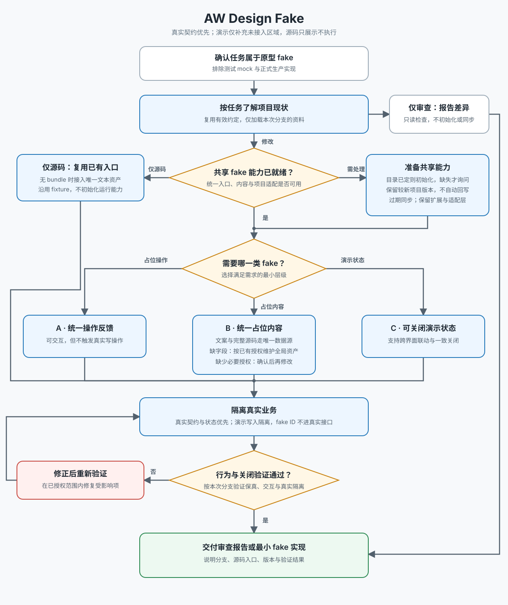

# AW Design Fake

## 目标

让原型工程的临时交互、占位内容和完整演示状态走可识别、可移除且不污染真实契约的统一路径。不要只因为用户说了「fake」就自写 toast、空回调、随机文案或业务化假对象；先判断 fake 类型，再复用对应入口。

本 SKILL 与具体项目无关：fake bundle 的内容、结构和版本由 SKILL 维护，项目侧只声明目标目录并提供一个适配文件。

## 开始前

1. 读 [文本工作流](docs/workflow.md)，它是执行事实源。
2. 读项目自己的约定：`AGENTS.md` / `CLAUDE.md` / 设计文档中关于假数据、演示开关、原型工作区边界的说明。项目没有成文约定时记为「无项目专有约束」，不停止。
3. 检查 fake bundle 状态：

   ```bash
   node <本 SKILL 目录>/scripts/fake-bundle.mjs --project-root <项目根目录> --check
   ```

   项目根目录没有 `.aw-design-fake.json` 时脚本会提示先初始化，见下节。
4. 状态为 `missing`、`outdated` 或 `drifted` 时，运行同一命令并把 `--check` 换成 `--write`。状态为 `newer` 时不得降级覆盖：先比较项目新增内容，把它回灌到 SKILL 的 `references/` 或 `assets/`，再决定是否提升 bundle 版本。
5. 搜索任务附近已有的 fake helper、业务域 `fake.ts`、演示状态目录和调用模式。
6. 按下面的分类只选择满足需求的最小 fake 层级。用户明确说「用 fake 方法」或「fake action」时，也必须完成这一步，不得把它泛化成任意模拟实现。



## Fake Bundle

### 首次初始化

项目还没有 fake bundle 时，先和用户确认目标目录（放在原型工作区的共享层，不要放进任一业务页面目录），再初始化：

```bash
node <本 SKILL 目录>/scripts/fake-bundle.mjs --project-root <项目根目录> --init --target <相对项目根的目录>
```

初始化会写入 `<项目根目录>/.aw-design-fake.json` 记录 `target`，并生成：

```text
<target>/
├── data.ts       # 受管：全局 FAKE_DATA，由 SKILL 的 CSV 与长文生成
├── actions.ts    # 受管：showFakeSonner 等通用 fake action
├── version.ts    # 受管：FAKE_DATA_VERSION 与 FAKE_LOGIC_VERSION
├── index.ts      # 受管：统一导出
└── adapter.ts    # 项目自有：只在缺失时创建一次，之后永不覆盖
```

`adapter.ts` 是唯一的项目耦合点，必须由人接上项目实现后才算完成初始化：

- `notify(notice)`：把 `{ title, description, actionLabel }` 交给项目真实的 toast / sonner 组件。
- `assetUrl(path)`：把静态资源相对路径转成项目的可访问 URL。

### 同步规则

- 所有调用方只从 bundle 目录入口导入，不直接依赖 `data.ts`、`actions.ts` 或 `version.ts`，也不创建 `fake-main.ts`、`fake-sonner.ts` 这类平铺入口。
- 受管文件的内容由 SKILL 决定，项目侧不手改。要改内容就改 SKILL 的 [references/fake-data.csv](references/fake-data.csv)、[references/fake-longform.md](references/fake-longform.md) 或 `assets/fake/`，再同步回项目。
- 同步只替换 `aw-design-fake:managed-start` / `aw-design-fake:managed-end` 之间的内容，保留项目在标记之外的注释和扩展。
- 目标文件没有 managed 标记时，`--write` 会先创建同名 `.aw-design-fake-backup` 再写入；完成后必须检查备份里的项目扩展并按需迁回标记之外，不能静默丢弃。
- canonical 内容发生任何变化时递增对应 semver patch；字段删除、重命名或行为不兼容时递增 major。项目文件不能手工提升版本却不把变更回灌到 SKILL。
- 同版本但 managed block 不同视为 `drifted`，以 SKILL 为准同步；项目版本高于 SKILL 时视为 `newer`，脚本不会自动覆盖。
- 改动脚本后先跑 `node <本 SKILL 目录>/scripts/fake-bundle.mjs --self-check`。

### 维护假数据

`data.ts` 不是手写文件，它由两份可维护资产生成：

| 资产 | 内容 |
| --- | --- |
| [references/fake-data.csv](references/fake-data.csv) | 字段表：`key,kind,value,note`。`key` 用点号表达嵌套，`kind` 取 `string` / `number` / `boolean` / `list` / `asset` / `longform`，`list` 用 `\|` 分隔。 |
| [references/fake-longform.md](references/fake-longform.md) | 长文正文。二级标题即字段名，段落用空行分隔；多段落生成数组并以 `<br/>` 连接。 |

`asset` 字段生成为 `assetUrl('<路径>')`，由项目 `adapter.ts` 决定真实 URL。改完任一资产都要提升 `assets/fake/version.ts` 中的 `FAKE_DATA_VERSION`，再同步到项目。

## 分类与实现

### A. 未实现功能的占位操作

适用于控件需要可点击、可选择或可提交，但对应后端能力暂未接入的情况。

- 在用户事件处理器中直接调用 bundle 导出的 `showFakeSonner()`。
- 不要自行调用项目的 toast API 重建提示，不要复制 `FAKE_DATA.sonner` 文案，也不要用 `console`、空回调或无反馈点击代替。
- 可以保留需求明确要求的瞬时本地 UI 状态，例如菜单选中项、展开状态或 tab；不得发起 HTTP 请求、调用真实 service、写真实 store 或制造持久化成功状态。
- 只有语义操作真正发生时提示。重复选择当前值、disabled 控件或没有产生操作的事件不应重复提示，除非用户明确要求。
- 真实能力接入后应能删除 `showFakeSonner()` 调用并接上正式 handler，不需要重写展示结构。

### B. 占位文案、数值与媒体

适用于界面需要假文案、假数字、假时间、假链接、假文件名或全局占位资源的情况。

- 写入任何占位字面量前，必须先逐字段检查 bundle 导出的 `FAKE_DATA`；已有同语义字段时直接复用，不得在业务 `fake.ts`、store、view-model 或 JSX 中另造近义值。时间统一使用 `FAKE_DATA.date`、`FAKE_DATA.time` 或 `FAKE_DATA.datetime`，人物、组织、数值和通用 ID 同理。
- 确认 `FAKE_DATA` 缺少所需语义后才新增全局字段：先改 SKILL 的 CSV 或长文并提升 `FAKE_DATA_VERSION`，再运行同步脚本，不要只改项目副本。
- 业务域的一组演示条目放在该域自己的 `fake.ts`，由该域的 data / view-model 消费；展示组件不得在 JSX、CSS 或页面数据中重复定义占位值。
- 业务域 `fake.ts` 只保存可替换内容，不承载 API、权限、store 或持久化逻辑。
- 假数据必须一眼可辨：域名使用 `example.com`，ID 使用 `*_00000042` 这类明显编号；一位数占位使用 `FAKE_DATA.smallNumber`（7），两位数及默认数值使用 `FAKE_DATA.number`（42）。不要编造看似真实的企业、人名、运行结果或错误原因。
- 不虚构倍数、可用性、节省时长或其他未经来源支持的指标；也不使用 lorem ipsum、feature one、sample content 或泛化 testimonial 作为填充内容，正文占位取 `FAKE_DATA.description` 或 `FAKE_DATA.article`。
- 严禁为了标识数据来源而改动用户可见 UI：标题、字段标签、值、Badge、说明和操作文案中不得添加「演示」「Fake」「Mock」「测试」「占位」等标记，也不得新增专门解释真假数据的提示。真假边界只在代码目录、类型、adapter、selector、ID 与请求隔离中维护。
- 用户可见占位内容使用中性的角色、序号或稳定空值，例如「当前用户」「成员 1」「账号 A」「—」；不要通过来源标签暴露它是假数据，也不要用具体真人、企业、账号或精确时间伪装成真实数据。
- 条目名称说明所覆盖的业务形态或边界，而不是说明其 fake 来源；覆盖有意义的差异，不堆同质样例。

### C. Fixture、seed、列表叠加与状态推进

适用于需要完整演示对象、跨组件读取、列表 / 详情联动、流程推进或本地模拟行为的情况。

- 业务域 fixture 优先放在该域的 `fake.ts`；跨页面的演示状态或模拟行为放在项目统一的演示状态层。真实数据与 fake data 只能在展示侧的 adapter、view-model 或 selector 层合并。
- 项目存在「填充假数据」这类演示开关时，导出 fixture、seed、mock catalog 或 mock fallback 的数据模块，其所有公开读取入口都必须经过该开关的 selector。项目没有开关而需求要求可关闭时，先和用户确认再引入一个，不要散落多个布尔量。
- React Hook 订阅该 selector；非 Hook getter 通过同一 selector 读取当前有效值。不能只在路由、页面入口或 JSX 外层做条件渲染。
- 开关关闭时返回真实数据或稳定空值，fixture / seed 数量必须为 0；列表、详情、统计、侧栏计数、关联选择器和跨模块 adapter 必须一致关闭。
- 开关开启时可以恢复演示数据，但不得改变真实 API 的请求、响应解释或真实对象写操作。
- 状态推进和模拟操作集中在明确标为「演示模拟」的入口或演示状态层，不混入真实配置、授权、凭证或生产动作区。

## 真实契约隔离

- fake 对象与真实对象必须能通过来源或明确身份区分；fake ID 不得发送到真实后端。
- 模拟操作只改变本地演示状态，绝不写真实对象；真实请求不得携带 fixture、preview 或仅用于演示的字段。
- 后端缺字段时优先不展示对应区块。只有需求明确需要 overlay 时才叠加 fake 字段，并确保演示开关关闭后完全消失。
- 不要为了实现 fake 去修改正式工程、BFF、真实 DTO、真实 API shape、auth 或 service 契约。

## 验证

按所选层级验证可观察行为：

- A 类：触发动作后出现统一 fake 提示；确认没有网络请求或真实持久化副作用。
- B 类：确认展示值来自 `FAKE_DATA` 或唯一的业务域 `fake.ts`，页面中没有重复副本。
- C 类：分别验证演示开关关闭与开启。关闭时 fixture / seed 为 0 或只保留真实数据，开启时演示数据恢复，相关列表、详情与计数保持一致。
- 结束前重新运行 `--check`：bundle 必须为 `current`，或明确记录为项目侧 `newer`，不能留下 `missing`、`outdated`、`drifted` 或缺失的 `adapter.ts`。
- 涉及 TypeScript 或状态逻辑时至少运行项目自身的类型检查；新流程或非平凡交互按项目文档做浏览器验证。
