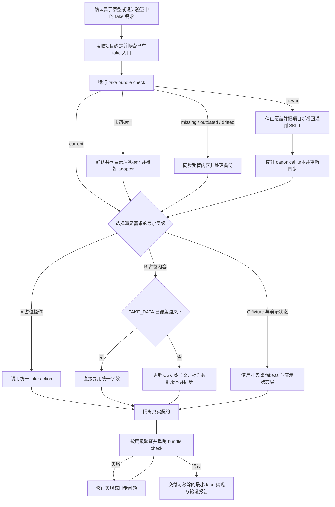

# AW Design Fake 文本工作流

本文件是执行事实源，`workflow.svg` 是与之同步的可视化投影。执行时读本文件即可，不需要为理解流程去读 SVG。

下面的 Mermaid 图用于精确呈现 bundle 状态、实现层级与验证回路；后续分阶段文字定义每个节点的具体执行要求。



## 阶段 1：确认任务属于本 SKILL

处理的是原型或设计验证工程里的占位交互、占位内容和演示数据。单元测试 mock、网络层 mock、正式生产工程的真实实现不在范围内，遇到时说明并退出。

## 阶段 2：读项目约定

读项目的 `AGENTS.md` / `CLAUDE.md` / 设计文档，登记：原型工作区边界、演示开关的名称与 selector、业务域 `fake.ts` 的存放约定、占位数据口吻要求。没有成文约定时记为「无项目专有约束」，继续执行。

同时搜索任务附近已有的 fake helper、业务域 `fake.ts`、演示状态层和调用模式，避免重复造入口。

## 阶段 3：检查 fake bundle

```bash
node <本 SKILL 目录>/scripts/fake-bundle.mjs --project-root <项目根目录> --check
```

### 分支 3a：未初始化

项目根目录没有 `.aw-design-fake.json` 时**停下**，与用户确认 bundle 目标目录（原型工作区的共享层，不放进任一业务页面目录），获准后：

```bash
node <本 SKILL 目录>/scripts/fake-bundle.mjs --project-root <项目根目录> --init --target <相对目录>
```

初始化会生成受管的 `data.ts` / `actions.ts` / `version.ts` / `index.ts`，以及项目自有的 `adapter.ts`。`adapter.ts` 必须接上项目真实的提示组件（`notify`）与静态资源工具（`assetUrl`）后才算完成，未接上时不要继续实现。

### 分支 3b：missing / outdated / drifted

用 `--write` 同步。同步只替换 managed 标记之间的内容；目标文件没有标记时脚本会先留 `.aw-design-fake-backup`，事后必须把备份里的项目扩展迁回标记之外。

### 分支 3c：newer

项目版本高于 SKILL 时**不得降级覆盖**。先比较项目新增内容，把它回灌到 SKILL 的 `references/fake-data.csv`、`references/fake-longform.md` 或 `assets/fake/`，提升版本后再同步。

### 分支 3d：current

直接进入阶段 4。

## 阶段 4：判定 fake 层级

只选满足需求的最小层级：

- **A 占位操作**：控件要可交互但后端能力未接入 → 调用 bundle 的 `showFakeSonner()`。
- **B 占位内容**：需要假文案、数值、时间、链接、媒体 → 复用 `FAKE_DATA`；字段不足时改 SKILL 的 CSV 或长文并提升 `FAKE_DATA_VERSION`，再同步。
- **C fixture 与演示状态**：需要完整演示对象、跨组件读取、列表详情联动或流程推进 → 业务域 `fake.ts` 与演示状态层，全部读取入口经过演示开关的 selector。

用户说「用 fake 方法」或「fake action」时同样要判层级，不得泛化成任意模拟实现。

## 阶段 5：真实契约隔离

- fake ID 不发往真实后端，fake 对象与真实对象可区分。
- 模拟操作只写本地演示状态，不写真实对象；真实请求不携带演示字段。
- 不修改正式工程、BFF、真实 DTO、API shape、auth 或 service 契约。
- 不在用户可见 UI 里标注「演示」「Fake」「Mock」等来源标记。

## 阶段 6：验证与交付

- A 类：触发后出现统一 fake 提示，无网络请求与真实持久化副作用。
- B 类：展示值来自 `FAKE_DATA` 或唯一业务域 `fake.ts`，无重复副本。
- C 类：演示开关关闭时 fixture / seed 为 0，开启时演示数据与列表、详情、计数一致恢复。
- 重跑 `--check`，结果必须是 `current` 或明确记录的 `newer`，且 `adapter.ts` 存在。
- 涉及 TypeScript 或状态逻辑时运行项目自身的类型检查。

任一验证不通过时停止并修正，不把未验证的 fake 标记为完成。

## 产物

最小可移除的 fake 实现、状态为 `current` 的 fake bundle，以及一份说明所选层级、改动文件与验证结果的交付报告。
