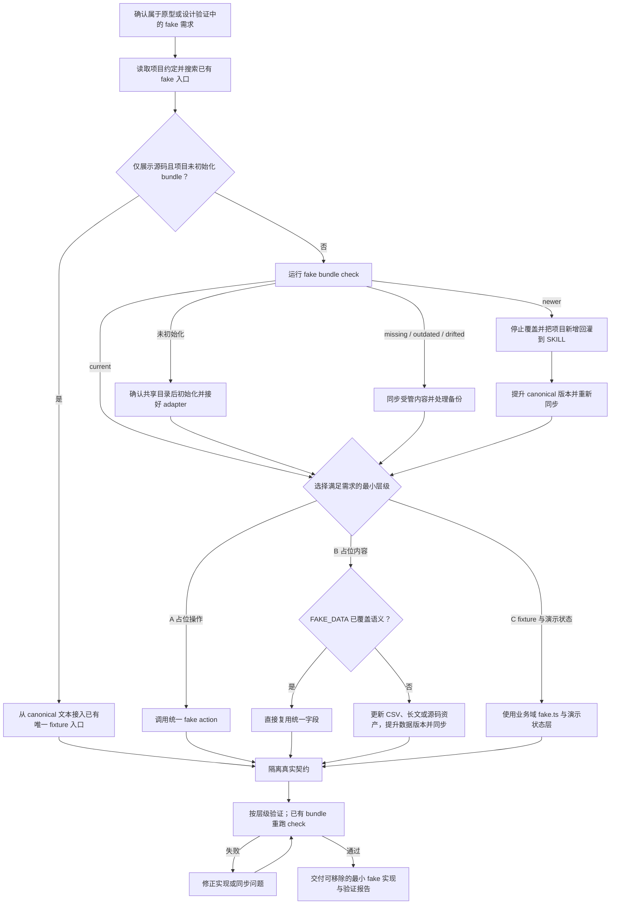

# AW Design Fake 文本工作流

本文件是执行事实源，`workflow.svg` 是与之同步的可视化投影。执行时读本文件即可，不需要为理解流程去读 SVG。

下面的 Mermaid 图用于精确呈现 bundle 状态、实现层级与验证回路；后续分阶段文字定义每个节点的具体执行要求。



## 阶段 1：确认任务属于本 SKILL

处理的是原型或设计验证工程里的占位交互、占位内容和演示数据。单元测试 mock、网络层 mock、正式生产工程的真实实现不在范围内，遇到时说明并退出。

代码展示、普通 / 高亮、换行 / 不换行等设计验证默认共用完整的 `assets/code/conway.ts.txt`，但不替换真实产品实现、单元测试或用户明确指定的其他示例。它是展示文本，不是演示状态推进逻辑。

## 阶段 2：读项目约定

读项目的 `AGENTS.md` / `CLAUDE.md` / 设计文档，登记：原型工作区边界、演示开关的名称与 selector、业务域 `fake.ts` 的存放约定、占位数据口吻要求。没有成文约定时记为「无项目专有约束」，继续执行。

同时搜索任务附近已有的 fake helper、业务域 `fake.ts`、演示状态层和调用模式，避免重复造入口。

## 阶段 3：检查 fake bundle

若本次仅需代码展示、项目尚无 bundle 且已有 Gallery / 原型 fixture 入口，直接将 canonical 源码逐字接入该唯一入口，再进入阶段 5；不要仅为展示文本初始化 bundle、添加 fake action 或引入运行模拟。遵循 [源码消费与保真约定](../references/code-demo.md)，不在各展示项维护副本。其余需求按以下 bundle 流程处理。

```bash
node <本 SKILL 目录>/scripts/fake-bundle.mjs --project-root <项目根目录> --check
```

### 分支 3a：未初始化

项目根目录没有 `.aw-design-fake.json` 时**停下**，与用户确认 bundle 目标目录（原型工作区的共享层，不放进任一业务页面目录），获准后：

```bash
node <本 SKILL 目录>/scripts/fake-bundle.mjs --project-root <项目根目录> --init --target <相对目录>
```

初始化会生成受管的 `data.ts` / `actions.ts` / `version.ts` / `index.ts`，以及项目自有的 `adapter.ts`。`adapter.ts` 必须接上项目真实的提示组件（`notify`）与静态资源工具（`assetUrl`）后才算完成，未接上时不要继续实现。

### 分支 3b：missing / outdated / drifted

用 `--write` 同步。同步只替换 managed 标记之间的内容；目标文件没有标记时脚本会先留 `.aw-design-fake-backup`，事后必须把备份里的项目扩展迁回标记之外。

### 分支 3c：newer

项目版本高于 SKILL 时**不得降级覆盖**。先比较项目新增内容，把它回灌到 SKILL 的 CSV、长文或相应 `assets/`，提升版本后再同步。涉及不兼容修改而用户未授权 MAJOR 升级时停止确认。

### 分支 3d：current

直接进入阶段 4。

## 阶段 4：判定 fake 层级

只选满足需求的最小层级：

- **A 占位操作**：控件要可交互但后端能力未接入 → 调用 bundle 的 `showFakeSonner()`。
- **B 占位内容**：需要假文案、数值、时间、链接、媒体或展示源码 → 复用 `FAKE_DATA`；源码固定使用 `FAKE_DATA.code.source`，语言使用 `FAKE_DATA.code.language`。字段不足时改 SKILL 的 CSV、长文或源码资产并提升 `FAKE_DATA_VERSION`，再同步。
- **C fixture 与演示状态**：需要完整演示对象、跨组件读取、列表详情联动或流程推进 → 业务域 `fake.ts` 与演示状态层，全部读取入口经过演示开关的 selector。

用户说「用 fake 方法」或「fake action」时同样要判层级，不得泛化成任意模拟实现。

源码由 CSV 的 `source` 类型指向 `assets/` 内 UTF-8 文本，生成器只读不执行，以安全字符串字面量写入 `data.ts`。不要通过 `longform` 的段落整理路径，不做 trim、HTML 实体转换、Unicode 归一化、换行转换或格式化。保持全文、注释、空白、空行、转义与末尾换行；不要另写 Text、greet 或长行样例。换行验证调整展示容器宽度或显示选项，不修改数据。

## 阶段 5：真实契约隔离

- fake ID 不发往真实后端，fake 对象与真实对象可区分。
- 模拟操作只写本地演示状态，不写真实对象；真实请求不携带演示字段。
- 不修改正式工程、BFF、真实 DTO、API shape、auth 或 service 契约。
- 不在用户可见 UI 里标注「演示」「Fake」「Mock」等来源标记。
- 源码预览只渲染 / 高亮 / 复制字符串，不把源码当模块导入、求值或放进可执行预览，不能启动其中的 `console.clear`、`setInterval` 或模拟循环。

## 阶段 6：验证与交付

- A 类：触发后出现统一 fake 提示，无网络请求与真实持久化副作用。
- B 类：展示值来自 `FAKE_DATA` 或唯一业务域 fixture，无重复副本。源码值与 canonical 文本逐字相等；普通 / 高亮 / 换行模式只改展示方式，复制仍返回完整原文，且无源码执行副作用。
- C 类：演示开关关闭时 fixture / seed 为 0，开启时演示数据与列表、详情、计数一致恢复。
- 已有 bundle 重跑 `--check`，结果必须是 `current` 或明确记录的 `newer`，且 `adapter.ts` 存在。仅展示源码且沿用已有 fixture 的分支记录「未初始化；仅复用源码文本」，不要求创建 bundle。
- 涉及 TypeScript 或状态逻辑时运行项目自身的类型检查。
- 维护本 SKILL 时运行 `node scripts/fake-bundle.mjs --self-check`：验证 canonical 指纹、生成字符串逐字回读、特殊字符、CSV / 长文兼容、初始化与同步、备份、adapter 保留和 newer 拒绝覆盖；再运行基础与 AW 校验器。

任一验证不通过时停止并修正，不把未验证的 fake 标记为完成。

## 产物

最小可移除的 fake 实现与已校验的 bundle，或仅展示源码的唯一 fixture 引用；报告所选分支、canonical 路径、消费字段、版本与验证结果。
