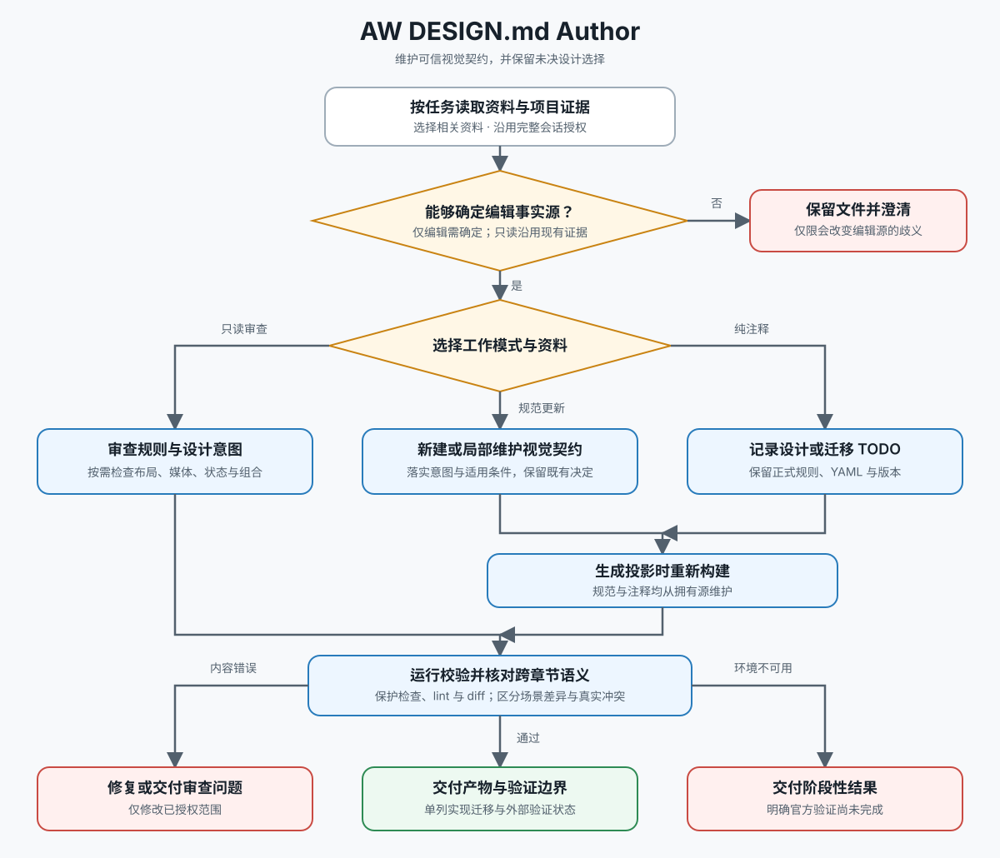

# AW DESIGN.md Author

Create and maintain `DESIGN.md` as a complete, verifiable visual contract. Work in the user's language and preserve their design intent and voice.



## Required References

Read these before normative authoring or reviewing:

- `references/spec-summary.md`: canonical schema and section model.
- `references/lint-rules.md`: official validation rules.
- `references/authoring-conventions.md`: naming, prose, ownership, and multi-theme conventions.

Use `references/example-full.md` for standalone systems, `references/example-code-backed.md` for mature component libraries, and `references/exemplar-patterns.md` for transferable design judgments.

## Scope and Ownership

Use this skill for every requested `DESIGN.md` creation, review, edit, or validation. It is not a website, screenshot, Figma, or code extraction tool.

Before writing, choose one ownership mode:

1. **Standalone:** `DESIGN.md` owns exact tokens and component appearance and must travel without the repository.
2. **Code-backed:** code owns component internals; `DESIGN.md` owns stable cross-component semantics and selection intent.
3. **Generated projection:** code owns the system and generates a self-contained `DESIGN.md`; edit the owning source, not the projection.

The scope test is: “Is this a formally verifiable visual rule another agent can apply consistently?” Visual rules belong here; behavior belongs in `AGENTS.md` or `CLAUDE.md`; implementation belongs in code or specifications.

## Work Modes

Classify the request before editing:

1. **Normative Contract Mode:** Use for creation, review, validation, or any edit that changes a token value, key, reference, theme definition, canonical prose rule, or ownership boundary. Run the complete authoring workflow and follow the project's versioning policy.
2. **Annotation Mode:** Use only when the user is iterating directly in HTML or implementation code and explicitly wants to record a pending `DESIGN.md` decision as comments without changing the current contract. This mode creates a detailed deferred TODO, not a normative design change.

### Annotation Mode

1. Inspect project instructions, the existing `DESIGN.md`, the owning section, and the implementation evidence behind the note. Preserve the current ownership mode.
2. Create a temporary baseline copy. Add the comment immediately before the owning key or section so its intended scope is unambiguous.
3. Start the note with `TODO(DESIGN):` and make it detailed enough that a future agent can resolve it without reconstructing the current session. Include:
   - the current implementation or observed behavior, with affected surfaces or paths when known;
   - the candidate contract change or question to revisit;
   - the reason and evidence for recording it, plus why the decision is deferred;
   - affected tokens, components, surfaces, themes, and states;
   - unresolved decisions or tradeoffs;
   - the next review action and the criterion for resolving or deleting the TODO.
4. Keep normative YAML unchanged: do not alter exact values, keys, references, theme entries, or prose that changes the contract. Do not edit implementation solely to make the annotation true.
5. Do **not** increment the `DESIGN.md` version for an annotation-only change.
6. Run the official lint and diff gate. The diff for this task must contain only comments. If a normative value or rule must change, leave Annotation Mode and use Normative Contract Mode.

Deferred TODOs may accumulate across implementation iterations. At the next normative design-system update, review all relevant TODOs together, resolve the decisions, update the owning contract and implementation as needed, remove resolved annotations, and apply versioning once for that normative batch.

## Complete Authoring Workflow

This workflow is mandatory for Normative Contract Mode; there is no quick or partial normative authoring mode. Even for a narrow normative request, inspect and validate the complete contract before finishing.

1. Inspect project instructions, existing `DESIGN.md`, component/theme sources, and distribution needs.
2. Select and state the ownership mode.
3. Establish intent: audience, personality, and desired emotional response.
4. Draft normative YAML for the full scope this document owns.
5. Write concise rationale in canonical section order: Overview, Colors, Typography, Layout, Elevation & Depth, Shapes, Components, Do's and Don'ts. Add domain sections only when genuinely needed.
6. Check semantic naming, token references, contrast, ownership boundaries, theme parity, and duplicate headings.
7. Run the official lint and diff gate. Do not finish while lint reports errors.
8. Report the result using the fixed completion template below.

For an existing file, create a temporary baseline copy, lint before editing, make the smallest owning-layer change, lint and diff afterward, then remove or retain the baseline according to the user's rollback preference.

## Validation

Run this skill's bundled `scripts/check.sh` from the skill directory, passing the current file and optional baseline. When invoking the official CLI directly:

```bash
npx @google/design.md lint DESIGN.md
npx @google/design.md diff DESIGN.prev.md DESIGN.md
```

Successful lint does not prove component contrast, interaction states, visual regression, or alternate-theme correctness when those are owned elsewhere. Name the external checks still required.

## Completion Template

Return only sections with useful information, in this order:

```markdown
## Result
<created/reviewed/updated, ownership mode, and file path>

## Validation
- Lint: <pass/fail and counts>
- Diff: <material changes or no regression>
- External checks: <required checks or none>

## Decisions Needed
- <only unresolved user decisions; omit section when empty>
```

## Non-negotiable Rules

- Never invent a non-canonical nested schema such as `theme.colors.*`.
- Never use prose to hide an exact visual decision missing from its owning layer.
- Never add generic “follow the tokens” boilerplate sections.
- Never silently rename tokens, change palettes, or treat zero lint warnings as full visual verification.
- Never leave duplicate or reordered canonical `##` sections.
