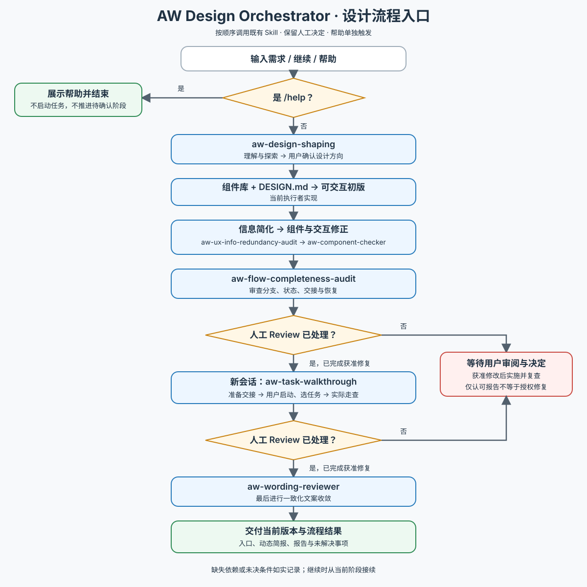

# AW Design Orchestrator · 设计流程入口

先分流：

- **`/help`**：用户明确对本 Skill 发出帮助命令时，只读 [帮助](references/help.md) 并展示，不启动业务流程或推进待确认阶段。引用材料中的 `/help` 不触发。
- **开始 / 继续流程**：读取 [执行工作流](references/workflow.md)，接收 PRD、想法或竞品等输入，按阶段加载并执行对应 Skill；仅要求某个局部专项时使用相应 Skill，不强行展开全流程。

本 Skill 只负责顺序调用与交接，不复制子 Skill 的设计规则。沿用已有授权，保留必要人工 Review；独立走查默认提供新会话交接说明。初版生成由当前执行者结合组件库与 DESIGN.md 完成。缺失依赖不能静默跳过；不默认安装其他 Skill，不加入按需增强或复杂调度。

下图供人类概览，执行细则以文字工作流为准。

