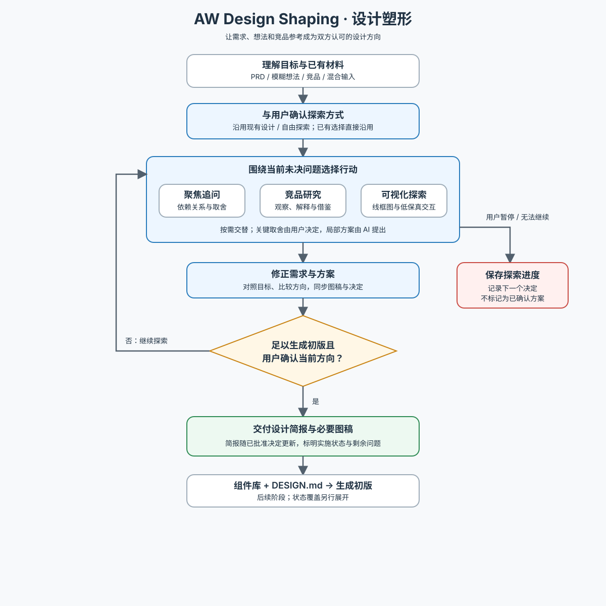

# AW Design Shaping · 设计塑形

与用户共同明确目标、任务与界面结构，交付可在组件库和 DESIGN.md 约束下生成初版的设计简报。先读 [工作流](references/workflow.md)，按当前问题选择追问、研究或可视化，不要求把所有输入补成 PRD，也不固定先问完再画图。

| 当前任务 | 按需资料 |
| --- | --- |
| 给出竞品体验地址、产品名，或需要外部参照 | [竞品研究](references/competitor-research.md) |
| 需要线框图、布局对比或交互来消除分歧 | [可视化对齐](references/visual-alignment.md) |
| 维护本 Skill、核对借鉴方法的边界 | [方法来源与取舍](references/sources.md) |

关键取舍由用户决定，局部方案由 AI 先提出。开始时说明并询问沿用现有设计还是自由探索，已有选择直接沿用。事实、推断、提案与已确认决定分别表达；主方案明确后收敛，不穷举后续流程完整性审查。简报随后续已批准的关键决定更新，并区分批准与实际实施状态。以当前方向得到用户确认和可交接简报为完成标准，探索原型不自动进入正式业务代码。

下图供人类概览；执行规则以文本工作流为准。

