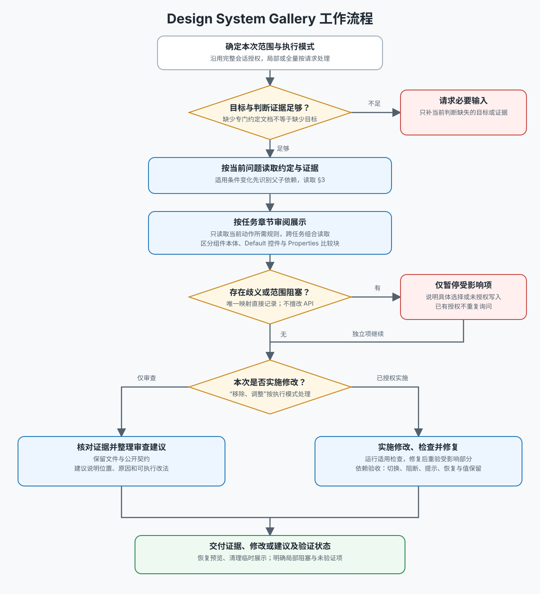

# AW Design System Gallery

以目标项目的事实源和 Gallery 约定为准，审查或优化组件展示。默认从用户指定的最小范围开始；用户明确要求批量、全量或一致性审计时，按授权扩展。

执行前读取 [Gallery 工作流](docs/workflow.md)：

## 路由

- 先读取目标目录适用的仓库规则、设计规范与 Gallery 文档，识别当地展示模型、术语、框架、项目配置和验证入口。
- 详细展示判断读取 [Gallery 审阅规则](references/gallery-rules.md)。
- 只有涉及组件契约、名称映射或 API 修改时，才读取 [组件 API 设计约束](references/component-api-design.md)。
- Skill 不内置任何项目的组件注册表、顺序表或属性映射，也不规定项目应使用 CSV、JSON、Markdown 或代码注释。

## 核心决策

1. **选择有审阅价值的轴。** 只纳入帮助理解组件视觉、内容结构、布局或关键交互状态的公开设计轴；组件调用数据、实现机制、便利行为、事件、调试项与内部状态即使保留在 API 中，也不自动成为 Gallery 轴。
2. **依赖分组优先。** 父轴后紧跟依赖子轴；无依赖时才按几何/布局、主视觉、内容/槽位、状态、行为作可调整兜底。
3. **遵循当地默认模型。** 项目使用 default 元数据时，它只列实际展示轴，并与最终展示轴顺序一致；没有展示轴的组件仍保留有意义的 default 示例和当地舞台边框，但省略整行 default Caption。是否归入 Temporary 另行判断。默认或推荐组合必须有证据，不凭结构猜测。
4. **映射现场判断。** 先检查目标框架的平台保留属性与项目映射约定；没有配置时只为当前范围推导。歧义先询问，不自动改变组件契约。
5. **渐进扩展范围。** 默认局部取证；用户明确授权或当前判断确有需要时，可读取相邻展示、共享基础设施或只读使用证据，并说明原因。写操作仍受任务授权约束。
6. **Caption 只描述组件契约。** Caption 只能展示真实公开 API 的设计轴和组件状态。容器宽度、舞台尺寸、布局 wrapper、触发方式等是示例条件，不得伪装成组件属性；重要的窄容器、溢出、响应式或触发场景应继续视觉覆盖，并在 Panel description 或场景说明中解释。
7. **通用分类保持领域中立。** 通用设计系统 Gallery 不创建 Conversation 等产品领域分组；可复用组件按 Foundations、Composites 等设计系统角色归类。产品领域分类留给产品专属 Gallery 或产品文档；迁移分类时保持 Panel ID 稳定，避免破坏链接和置顶状态。

## 实现与交付

遵循目标 Gallery 的内容、Caption、边界提示、Token 与验证方式。没有约定时使用中性、可比较且不改变组件行为的 fallback。

示例布局先比较可用宽度与示例固有宽度：完整容纳时单行展示，否则使用显式且均衡的网格或纵向排列；不要依赖自动换行决定比较结构。对每个展示样本主动判断：组件真实占位范围是否因自身边界不明显而难以辨认，以及显示范围是否对当前审阅有价值。仅在两者同时成立时，优先复用目标项目既有的 Dashed Light / line-light 范围提示。该提示必须是 Gallery-only 的外部包裹，不得传入组件、改变组件布局或冒充公开 API；目标项目没有既有约定时，才使用中性且不改变行为的虚线范围 fallback。

浮层、菜单、Popover 等表面应直接展示其表面本身；只有触发方式属于组件公开契约且是审阅目标时，才把触发器纳入对比。保持语义排序、尺寸边界、键盘与焦点等可访问性检查，并在适用主题、视口、窄容器、溢出和响应式条件下完成视觉复核。

项目专属顺序或映射值得复用时，建议用户选择是否写回目标仓库；未经授权不创建或更新项目配置，也不写入 Skill。运行与范围和风险相称的项目检查，报告证据、修改、验证、假设和未解决债务。
