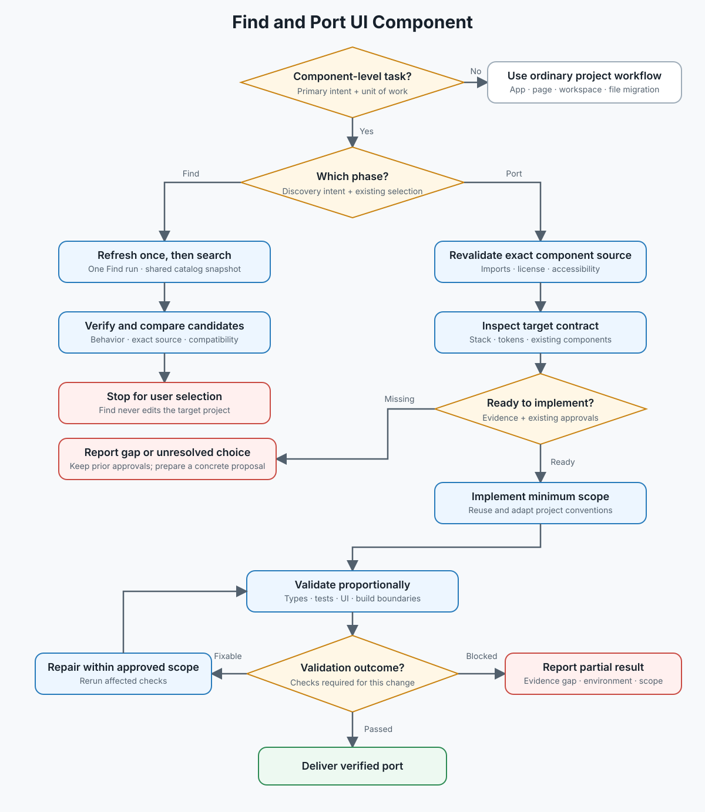

# AW Find and Port UI Component

Discover suitable implementations or adapt a selected reference to the target project.

Read the [workflow](docs/workflow.md) to select one phase and apply its shared evidence, authorization and completion rules. Then read only the selected phase:

- [Find](references/find.md): discovery, comparison and recommendations; ends at explicit user selection.
- [Port](references/port.md): requested implementation of an explicitly selected candidate or exact source.

An exact URL supplied only for comparison remains Find. Ordinary local fixes without discovery or reference porting are outside this skill.

