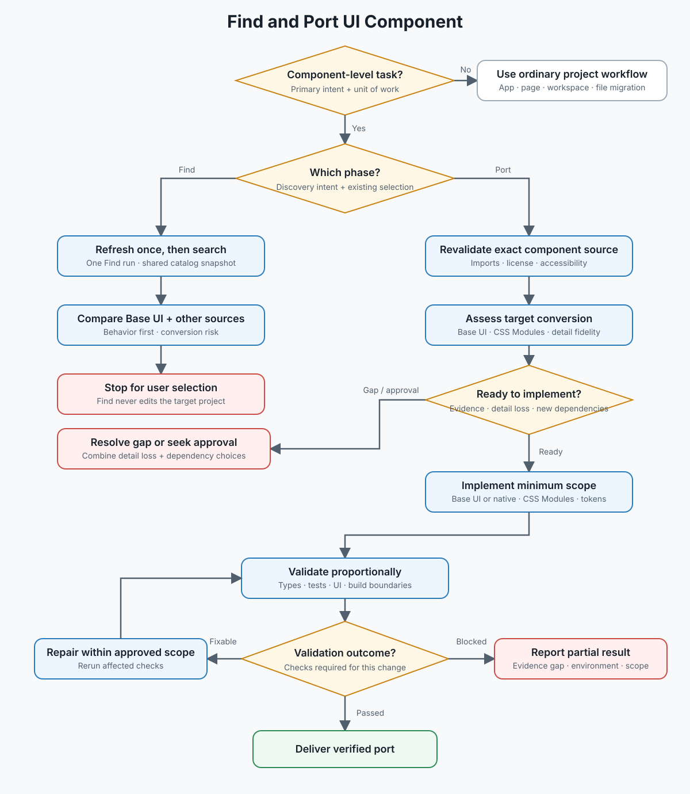

# AW Find and Port UI Component

Discover suitable Base UI and other React implementations, or adapt a selected reference into a Base UI + CSS Modules target, when the request centers on one concrete UI component.

Read the [workflow](references/workflow.md) first to apply the intent-and-granularity gate, select one phase and use its shared evidence, authorization and completion rules. Then read only the selected phase:

- [Find](references/find.md): compare verified Base UI and other candidates by behavior and conversion risk; ends at explicit user selection.
- [Port](references/port.md): adapt an explicitly selected candidate or exact source to a React target's Base UI + CSS Modules conventions. Confirm known loss of requested detail or required new dependencies before conversion.

Do not trigger from the mere presence of a design branch, local reference source, copied files or a second application. Whole-app or page migration, workspace splitting and dual-app initialization stay in the project's ordinary workflow. A local or same-repository source remains eligible when the request identifies the exact component implementation and its target component.

An exact component URL supplied only for comparison remains Find. Ordinary local fixes without discovery or reference porting are outside this skill.

