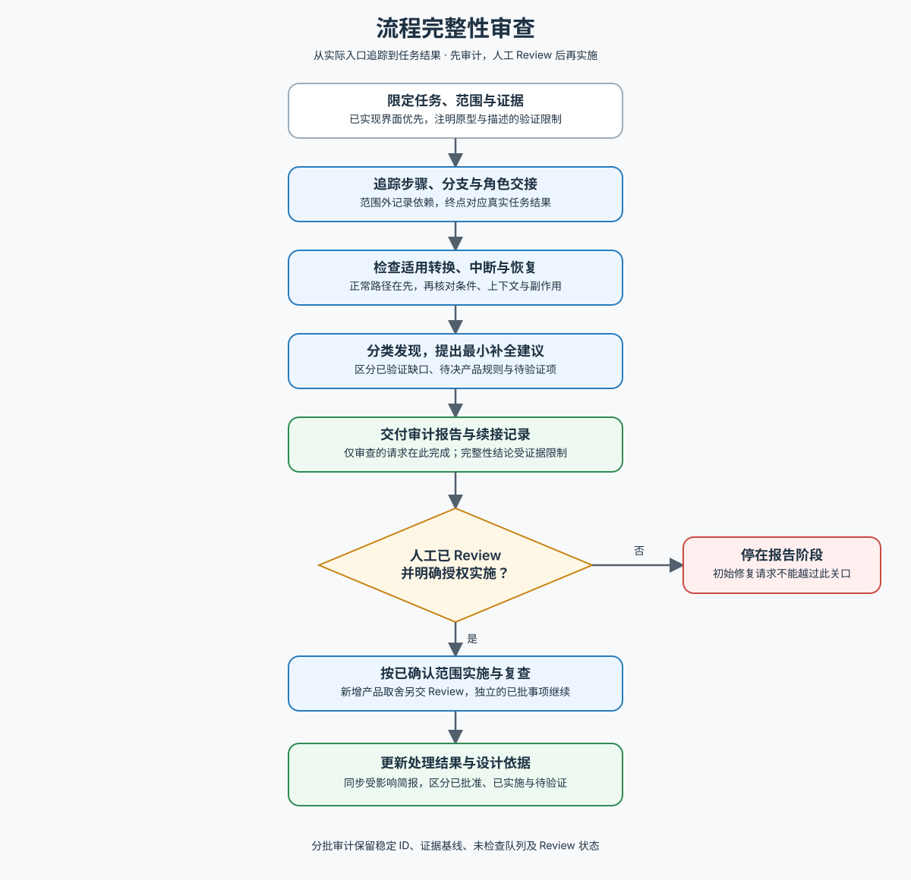

# 流程完整性审查

检查约定范围内的用户流程在正常、异常和中断情况下，是否交代了必要步骤、后续行为与完成结果。以已实现界面及相关源码为主要证据，也接受设计稿、原型和需求描述，并明确相应验证限制。

先读 [工作流](references/workflow.md)。完整审计或需要换上下文续接时，使用 [审计记录](references/audit-record.md)；维护方法或核对借鉴边界时，读取 [来源与取舍](references/sources.md)。不因局部审查加载全部资料。

跨角色、跨系统追踪到任务真实结果，范围外部分只记录交接和依赖。区分已验证缺口、待决产品规则与待验证项；缺少业务规则时给出推荐方案和理由，不把提案伪装成既有要求。状态按实际条件选择，不机械穷举或虚构产品能力。批准的补全改变主路径或关键规则时，同步现有设计简报与受影响图稿，避免旧依据覆盖新决定。

**报告交付后必须等待人工 Review，即使初始请求已包含修复。** 用户审阅后明确授权实施哪些建议，才进入修改与复查；详见工作流的“交付审计并等待人工 Review”。审计记录可以保存，审计阶段不修改业务实现。仅审查的请求以报告交付为完成。

下图供人类概览，执行规则以文字工作流为准。

