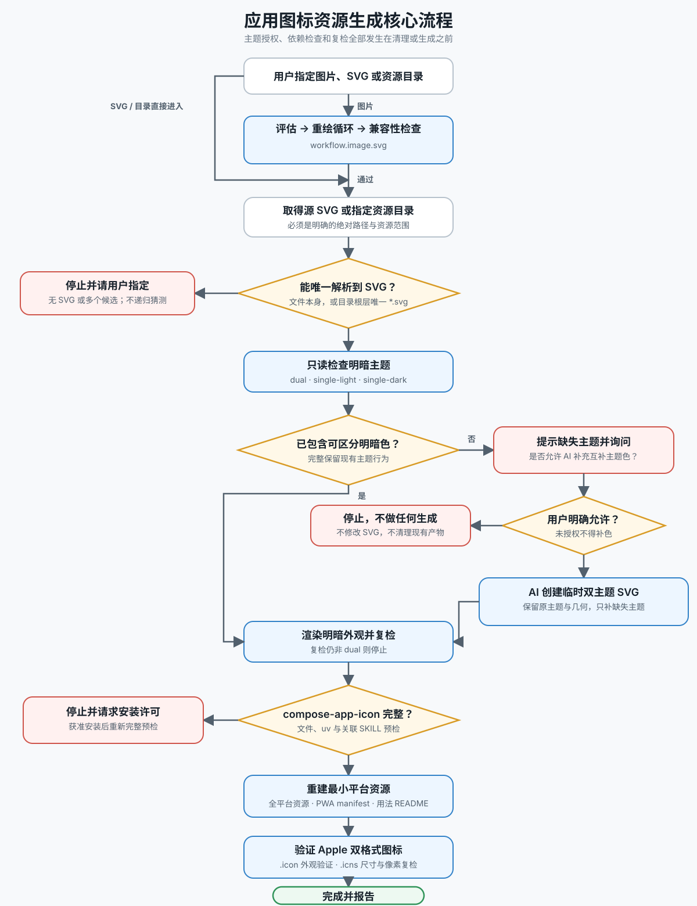

# AW 应用图标资源生成

本 SKILL 独立存放。每次运行必须通过 `--project-root` 显式指定目标 `favicon-package` 目录，禁止根据当前工作目录或 SKILL 所在位置猜测目标。

只使用项目根目录直属的唯一一个 `*.svg` 作为唯一事实源。若不存在 SVG，停止并请用户添加；若存在多个，列出文件并询问哪一个是唯一事实源，禁止自行猜测。

## 流程概览



## 预检

运行生成脚本或修改任何生成目录之前，必须检查项目级依赖 `<project-root>/.agents/skills/compose-app-icon`。仅当以下文件全部存在时，才视为安装完整：`SKILL.md`、`scripts/validate_icon.py`、`scripts/icon-schema.json`、`scripts/pyproject.toml`、`scripts/uv.lock`。

若依赖缺失或不完整：

1. 立即停止，不生成资源，也不清理现有产物。
2. 告知用户必须安装 `compose-app-icon`，说明预期安装位置，并请求安装许可。
3. 仅在用户明确同意后，使用 `$skill-installer` 或其他可信的 SKILL 安装方式，将准确的 `compose-app-icon` 安装到 `<project-root>/.agents/skills`。禁止依据模糊名称或未经验证的仓库安装；若找不到可信来源，请用户提供来源，不得猜测。
4. 安装后重新检查必需文件，完整阅读 `compose-app-icon/SKILL.md`，然后自动继续原生成任务。

用户授权前禁止安装依赖。依赖已经存在时，也必须先完整阅读其 `SKILL.md`，并遵循其中的 `uv` 预检要求。

## 生成

运行：

```bash
python3 scripts/cook.py --project-root /绝对路径/favicon-package
```

脚本依赖 `rsvg-convert` 与 Pillow，只会替换各平台的生成目录。

## 最小产物

- `web/favicon.svg`：保留源 SVG 内部的主题切换；`web/favicon.ico` 仅作为旧环境的亮色回退。网页 UI 应直接使用根目录 SVG。
- `iOS&macOS/app/app.icon`：唯一的 Apple 应用图标产物，同时支持 Default、Dark 与专用高对比 Mono 外观。
- `iOS&macOS/menu-bar/`：包含一个 macOS Template Image SVG，以及 1x/2x PNG；由 macOS 自动着色。
- `windows/app.ico`：稳定的应用图标。由于 ICO 无法在内部切换主题，只有托盘保留 `tray-light.ico` 与 `tray-dark.ico`。
- `linux/app.svg`：保留 SVG 内部主题切换。
- `android/`：只包含一套自适应图标资源；系统主题图标使用 monochrome 图层，不重复生成明暗资源树。

生成平台资源时，不额外创建说明文档、清单、预览、校验和、锁文件、联系表；平台原生自适应格式能够处理外观时，也不显式复制明暗资源。

## Apple `.icon` 验证

生成脚本必须使用 `<project-root>/.agents/skills/compose-app-icon` 校验 `app.icon`，再使用 Icon Composer 的 `ictool` 分别渲染 iOS 与 macOS 的 Default、Dark、Tinted（Mono）及 Clear 模式。渲染图仅用于临时验证，不得保留。

若 Icon Composer 本体不可用，保留已经通过 Schema 校验的 `.icon` 包，并明确报告仅跳过了引擎渲染。禁止用 `.icns` 替代所需的 `.icon` 格式。

## 不变量

- 从 SVG 中提取颜色，不在脚本内重复维护调色板。
- 保留源图几何结构及其 `prefers-color-scheme` 行为。
- Apple Mono 专用资源必须是透明底上的不透明白色前景遮罩，不能依赖 Icon Composer 从品牌色自动推导 Mono 对比度。
- 应用平台的遮罩由平台负责；不得把圆角烘焙进 iOS、Android 自适应图标或 Icon Composer 背景。
- macOS 菜单栏与 Windows 托盘图标必须是透明底单色状态图标，不能直接缩小全彩应用图标。
- 不覆盖产品仓库中的集成代码；本 SKILL 只重建图标资源库。
