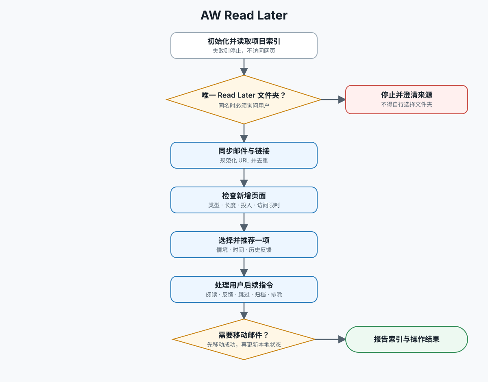

# AW 稍后阅读内容

手动、一次只处理一项内容的阅读助手。来源固定为当前已登录 Outlook 中显示名称恰好是 `Read Later` 的文件夹。

执行时先读取 [稍后阅读文本工作流](docs/workflow.md)。



## 核心边界

- 只有请求明确涉及 `Read Later` 文件夹，或涉及当前已经推荐的内容时才触发。
- 如果存在多个同名文件夹，先询问用户；不要自行猜测来源。
- 只推荐一个可访问且有实质内容的链接。内容类型可以是文章、仓库、帖子、讨论、文档、项目页、视频、课程页或其他可阅读页面。
- 不安排或运行自动处理；只有用户提出请求时才执行。
- 暂时跳过保留在 `Read Later` 中，不等于永久排除。

## 不可跳过的安全规则

- 每次推荐或处理前，先在当前项目根目录初始化并读取 `data/aw-mail-read-later/` 项目索引；失败就停止，不访问网页、不推荐。
- 只排除明显没有阅读价值的链接，如退订、偏好设置、隐私政策、跟踪、社交分享、图片、像素和纯跳转链接；无法判断时保留并说明依据。
- 网页无法访问时不推荐、不自动删除；先说明原因，并询问是否把来源邮件移到 `Deleted Items`。
- 用户明确永久排除时，只把对应邮件移到 `Deleted Items`，不要永久删除；用户确认完成后，只把唯一对应的来源邮件移到 `Archive`。
- Outlook 移动成功前，不得把本地记录标记为 `deleted` 或 `archived`；始终使用最新结果中的准确邮件 ID，身份不明确时一次只操作一封邮件。

## 工作流

1. 初始化并读取项目索引，遵循 [CSV 数据结构](references/data-schema.md)。
2. 同步精确的 `Read Later` 文件夹：先取邮件元数据，再按需读取正文，提取并规范化链接，写入索引，按规范化 URL 去重。
3. 检查新增或需要重试的页面，根据内容类型记录标题、类型、长度、预计投入和访问限制。
4. 综合当前请求、历史反馈、时间和投入窗口，只推荐一项，并按输出格式报告来源和理由。
5. 按用户后续指令阅读、总结、翻译、记录反馈、暂时跳过、归档、排除或重试。详细分支见 [工作流程细则](references/workflow.md)。

默认时间匹配：工作日白天优先 20 分钟以内，工作日晚间可接受 45 分钟以内，周末可以推荐长内容；时区不明确时使用 `Asia/Shanghai`。用户明确反馈覆盖这些默认值。

## 输出格式

推荐时先给出：

```text
推荐：<内容名称>
类型：<content_type>
链接：<URL>
预计投入：<分钟数> 分钟（<长度估算依据>）
来源：<发件人> · <收件时间> · <邮件主题>
理由：<为什么适合当前情境和时间>
```

推荐或完成同步后，再报告：

```text
索引：<已创建/已加载>；新增 <n> 项；已索引 <n> 项；跳过或排除 <n> 项；重复清理 <n> 封
```

没有变化时报告“索引：已加载；没有新增内容”。阅读结果要把内容总结或翻译与个人建议分开；归档或删除时说明匹配到的邮件和目标文件夹。

## 项目索引

不要把运行数据写进技能目录或全局安装目录。初始化命令为：

```bash
python3 <skill-directory>/scripts/read_later_index.py init --data-dir <project-directory>/data/aw-mail-read-later
```

使用 `scripts/read_later_index.py` 完成 URL 规范化、内容新增或刷新、网页检查时间、状态变更和反馈追加；不要临时创建第二套数据结构。

触发边界的正负例见 [触发评测](evals/trigger_cases.json)。

## 示例请求

- “帮我从 Outlook 的 Read Later 文件夹找一项适合当下阅读的内容”
- “从 Read Later 里推荐一个适合今天看的 GitHub 仓库”
- “阅读 Read Later 里刚才推荐的项目页，给我总结它解决什么问题”
- “把 Read Later 里这个仓库的 README 翻译成中文”
- “这项 Read Later 内容我暂时跳过”
- “我完成了刚才推荐的内容，归档它”
- “以后不要再推荐 Read Later 里的这个，移除邮件”
