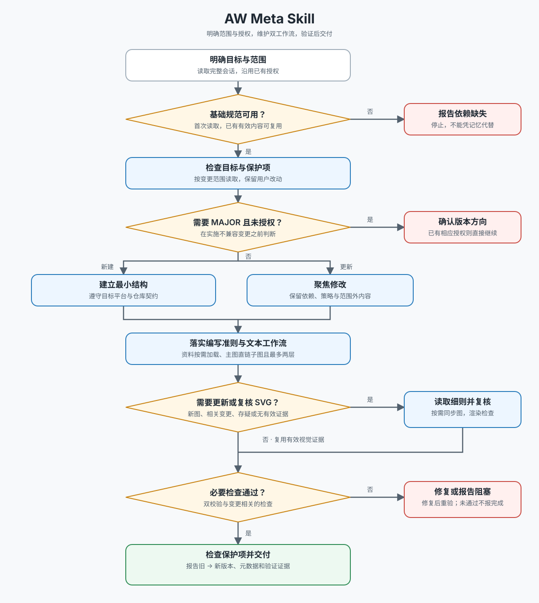

# AW Meta Skill

本 SKILL 是 `$skill-creator` 的增量包装，不替代其通用规范。开始创建或更新任何目标 SKILL 前，必须先完整读取并遵循当前环境中的 `skill-creator/SKILL.md`；如果该基础 SKILL 不可用，停止并说明缺失，不能凭记忆重建它的规则。

## 附加交付契约

除 `skill-creator` 的要求外，每个目标 SKILL 必须同时满足：

1. `SKILL.md` frontmatter 的 `metadata` 包含非空的 `version`、`author`、`creation_context`。
2. `docs/workflow.md` 存在，作为执行时优先读取的文本工作流，准确描述该 SKILL 的主要阶段、关键判断、停止条件和最终产物。
3. `docs/workflow.svg` 存在，作为 `workflow.md` 的可视化投影，并与文本工作流保持一致。
4. `SKILL.md` 正文使用 Markdown 链接引用 `docs/workflow.md`，并使用 `` 引用流程图。
5. 创建和更新完成后，同时运行基础校验器和本 SKILL 的附加校验器。

执行本 SKILL 时，先完整读取 [AW Meta Skill 文本工作流](docs/workflow.md)；文本工作流足以指导执行时，不要为了理解流程而读取 SVG。仅在创建、更新或视觉核对流程图时检查 SVG：



## 工作流程

### 1. 读取基础规范与目标现状

完整读取 `$skill-creator`。若为更新，先检查目标 SKILL 的 `SKILL.md`、`docs/workflow.md`、`docs/workflow.svg`、脚本、引用资料及调用关系；保留不在用户范围内的现有字段和资源，不重新初始化已有目录。

明确目标 SKILL 应处理的真实请求、触发边界、必需资源和可验证结果。不要把本包装层的约束扩张成与用户目标无关的目录或文档。

### 2. 创建或更新目标 SKILL

新建时，优先使用 `$skill-creator` 提供的 `init_skill.py` 初始化标准结构，再补充本 SKILL 要求的 `docs/`。更新时进行聚焦修改，避免覆盖现有 invocation policy、dependencies、资源或用户改动。

按照基础规范编写简洁、可发现且具区分度的 `description`，把核心决策放在 `SKILL.md`，只在确有需要时增加脚本、references 或 assets。

### 3. 维护版本元数据

目标 `SKILL.md` 使用以下结构：

```yaml
metadata:
  version: "1.0.0"
  author: "author_id"
  creation_context: "说明该 SKILL 为何在此业务或工作流语境中创建。"
```

- `version` 使用语义化版本 `MAJOR.MINOR.PATCH`。新建默认为 `1.0.0`。更新现有 SKILL 时，默认把 MINOR 加一，即 `+0.1.0`；只有明确属于小改动的修复、澄清、文档或内部实现调整才把 PATCH 加一，即 `+0.0.1`。
- 只有用户明确要求升级大版本号时才增加 MAJOR。不得自行推断或主动提升 MAJOR；若改动具有不兼容性但用户未明确授权大版本升级，停止并向用户确认。
- 只修改目标 SKILL 时才升级其版本。每次变更版本号都必须在交付中明确通知用户，报告旧版本与新版本；不得静默升级。
- `author` 优先沿用现有值；新建时从用户明确输入、仓库约定或当前项目上下文中确定。无法可靠推断时再询问，不能虚构个人身份。
- `creation_context` 使用稳定的一至两句话说明创建该 SKILL 的业务背景、重复工作或决策需求。不要粘贴临时对话、日期流水或实现步骤。更新时默认保留；只有目标用途或业务语境实质变化时才同步修订。
- 旧 SKILL 使用 `context` 时，更新过程中迁移为 `creation_context`，除非外部调用方明确依赖旧键；存在依赖时保留兼容键并说明原因。

### 4. 创建或同步文本工作流与流程图

每次创建或更新都检查 `docs/workflow.md` 和 `docs/workflow.svg`，缺失则创建，流程变化则同步修改。先以当前 `SKILL.md` 的真实工作流修订 Markdown，再据此维护 SVG；执行型 Agent 默认读取 Markdown，只有生成、更新或视觉核对时才需要读取 SVG。

`workflow.md` 必须：

- 是独立可读的文本工作流，不依赖 SVG 才能理解；
- 明确描述主要阶段、关键判断、停止条件和最终产物；
- 使用简洁的标题、编号步骤和分支说明，避免复制整份 `SKILL.md`；
- 明确声明它是执行事实源，SVG 是与之同步的可视化投影。

`workflow.svg` 必须：

- 是独立、可缩放的 SVG，具有 `viewBox`；
- 包含 `<title>`、`<desc>`、`role="img"` 和清晰的文本标签；
- 表达目标 SKILL 的实际阶段顺序、重要分支、停止条件与交付结果，而不是通用占位流程；
- 使用内嵌样式和系统字体，不依赖远程图片、字体、脚本或外部样式表；
- 在浅色背景上保持可读，并为连线、节点和状态提供足够对比度。

删除、合并或新增阶段后，`SKILL.md`、`workflow.md` 与 `workflow.svg` 必须一致；不要仅为了通过校验保留过时内容。

### 5. 校验与交付

先运行 `$skill-creator` 的基础校验：

```bash
python3 /path/to/skill-creator/scripts/quick_validate.py /absolute/path/to/target-skill
```

再运行附加校验：

```bash
python3 /path/to/aw-meta-skill/scripts/validate_aw_skill.py /absolute/path/to/target-skill
```

附加校验只证明结构性不变量成立；仍需人工核对文本工作流与流程图是否真实反映阶段和判断、两者是否一致、元数据是否准确、版本升级是否合理，以及基础 `skill-creator` 的内容质量要求是否满足。有脚本时运行其最小相关测试。

最终报告目标路径、明确的版本变化（旧版本 → 新版本）、author/creation_context 的取值、文本工作流与流程图状态和全部校验结果。即使版本变化是任务中的附带动作，也必须主动通知用户。
