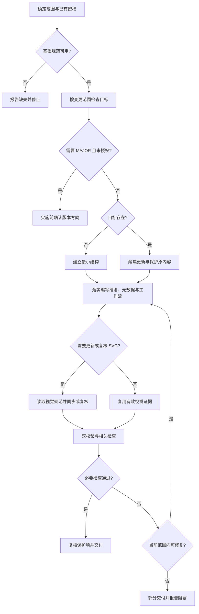

# AW Meta Skill 工作流

本文是执行事实源，workflow.svg 是面向人的可视化投影。流程变化时，先根据用户需求与有效契约修订本文，再同步 SVG 和入口；过时的投影不能覆盖当前授权。

## 输入与产物

输入是目标 Skill 的路径、用途和变更范围。产物是满足基础规范与 AW 契约的 Skill 包：版本元数据、独立可读的文本工作流、语义一致的 SVG，以及相应验证证据。仅咨询、执行现有 Skill 或修改仓库级文档，不启动创建流程或升级 Skill 版本。

## 确定范围与读取资料

首次使用时完整读取当前环境的 `skill-creator/SKILL.md`。本会话已读且仍适用的内容可复用；版本变化、上下文丢失或存在冲突时重新核实。无法取得基础规范且没有可靠已读内容时停止并报告缺失，不凭记忆重建。

从完整会话与项目约定确定用途、路径、触发边界和可验证结果。已明确的信息与授权直接沿用；只有无法可靠推断且影响用途、授权或作者身份的必要信息才询问。

| 任务 | 读取和检查范围 |
| --- | --- |
| 新建 | 基础规范、目标目录约定和实际需求；只建立有用途依据的资源 |
| 小修或局部更新 | 目标入口、待改文件及与本次变更有关的引用/调用；核对所需工作流文件是否存在，不默认通读所有资源 |
| 用途、接口或流程变化 | 扩展到受影响的工作流、实现、依赖与消费者，判断兼容性和同步范围 |
| SVG 创建、修改或视觉审查 | 读取 [SVG 规范](../references/workflow-svg.md) 并查看相关图；其他任务无需加载视觉细则 |

## 创建或更新

新建可使用基础初始化器，但先确认它的输出符合目标契约。若初始化器强制生成目标仓库禁止的供应商专属 metadata，直接建立最小结构。更新不重新初始化；保留用户未提交改动、已有策略、依赖和范围外资源，也不顺带删除既有平台适配。

在实施不兼容变更前判断 MAJOR 授权；未获明确授权则暂停并给出具体版本选择。已获相应授权时继续。把与本次编辑有关的保护项用于最终 diff 复核，不为保护文件而通读全部无关内容。

编写目标的 description、入口、工作流与引用资料时，落实 [目标 Skill 编写准则](../SKILL.md#目标-skill-编写准则)。这些准则约束生成的 Skill，不仅约束本次创建过程；根据目标任务写成具体规则，避免把通用准则原样复制到每个产物中。

### 元数据与版本

- 新建 `metadata.version` 默认 `1.0.0`。普通更新提升 MINOR、PATCH 归零（`1.4.2 → 1.5.0`）；明确的小修只提升 PATCH（`1.4.2 → 1.4.3`）。只有用户明确要求才提升 MAJOR，并将 MINOR/PATCH 归零。
- 每次实际修改目标 Skill 的指令、资源或实现都同步升级其版本；仅修改仓库级文档不升级。仓库有版本索引时，重读并精确更新目标行，保留并发改动。
- `metadata.author` 沿用已有值；新建时从用户输入或可靠项目约定确定，无法推断才询问。
- `metadata.creation_context` 用稳定的一至两句话说明业务背景或重复需求，不写临时对话、流水日期或实现步骤。默认保留，仅当用途或语境实质改变时修订。旧 `context` 无外部依赖时迁移，有依赖则保留兼容键并说明原因。

### 工作流与投影

所需工作流缺失时补齐；已有内容仅同步受影响部分。文本工作流独立描述阶段、关键判断、停止条件、异常路径和最终产物；可保留精确命令、文件与状态。正文是规则事实源，不复制整份入口。

复杂分支、回路、并行或跨阶段依赖难以用文字追踪时，使用适合的 Mermaid 图补充；简单线性流程无需强加图。关键条件仍需有可检索的文字定义。

流程变化先改 Markdown，再同步 SVG 与入口。SVG 提炼人类理解所需的阶段、核心分支和交付状态，保留不同实现方式及授权门槛；工程细节可留在正文或 Mermaid。没有语义变化时不重写或重画投影。

## 验证与交付

每次创建或更新完成后都运行两项校验，路径按实际环境解析：

```bash
python3 /path/to/skill-creator/scripts/quick_validate.py /absolute/path/to/target-skill
python3 /path/to/aw-meta-skill/scripts/validate_aw_skill.py /absolute/path/to/target-skill
```

脚本或行为变化时运行相关行为测试；纯文字修改不自动触发无关测试。必要检查失败时修复本次变更引起的问题，再重跑受影响检查，不因一次通过而重复全套测试。校验器与已有合法字段契约冲突时，保留字段并记录工具、退出码和冲突，不能删用户配置来凑通过。

SVG 新建、图本身或流程语义变化、视觉规则变化、存在可读性疑点时，需要读取视觉规范并渲染或预览。其他修改可复用与当前图及规则对应、可追溯且未失效的视觉复核证据；没有有效证据时仍需复核。需要复核但工具缺失时报告未完成，不将其记为通过。

双校验只证明结构性要求；附加校验不是完整 Markdown/CSS 解析器或安全净化器，也不能证明语义、视觉或任务效果。交付前检查受影响文档的语义一致性、元数据、版本与保护项。修复、验证和相关复核属于已授权工作，无需在第一版实现后另等确认；无法修复的必要检查失败则交付部分结果并报告具体阻塞。

新建或实质改变目标的用途、触发边界或文档结构时，用真实适用请求、易混淆反例和局部修改请求走查：描述能否选对任务，入口能否找到所需资料，是否被迫读取无关内容或过早停下。小修只复核受影响部分。检查描述、读取条件和完成边界在目标文件中的实际落点；结构通过或字数减少不能代替执行效果，未做模型回放时如实说明。

最终报告目标路径、旧版本 → 新版本、author/creation_context、文本与 SVG 状态，以及实际检查或复用的证据。未验证项明确列出，自评不得标为独立人工评审或盲评。

## 决策与恢复


