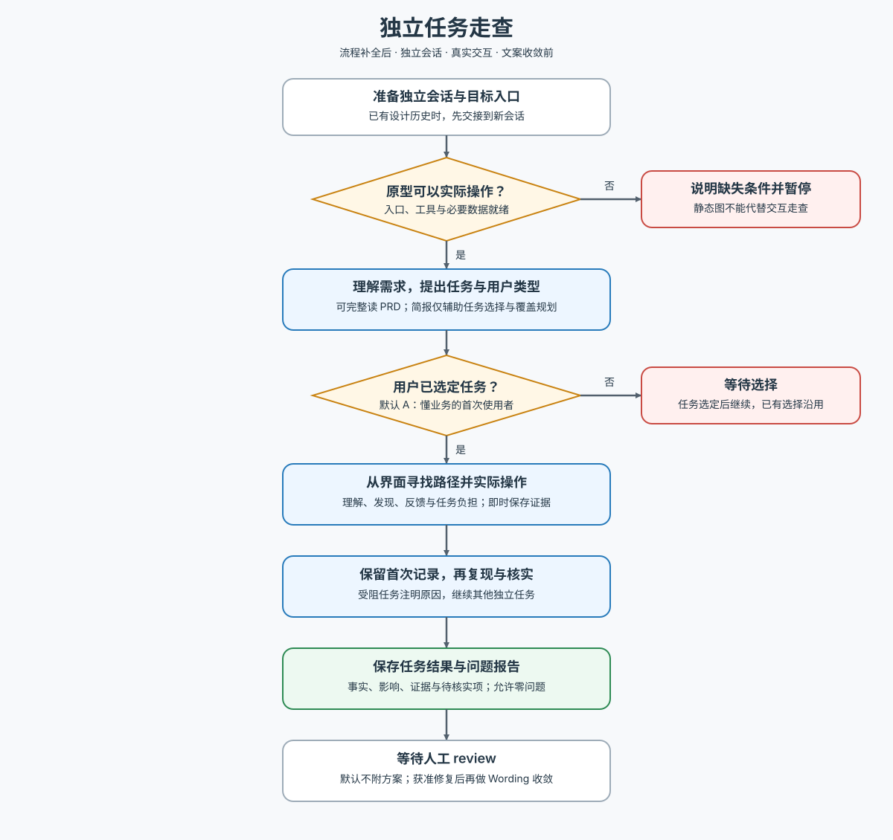

# AW Task Walkthrough · 独立任务走查

在独立新会话中，从用户目标出发实际操作已完成的可交互原型或产品，判断能否理解、发现并完成任务，以及流程是否带来不必要的负担。

执行前读取 [工作流](references/workflow.md)。允许完整读取 PRD；其他需求输入先澄清必要信息。提出候选任务供用户选定，同时提供 A（懂业务、首次使用产品）、B（业务与产品新手）、C（熟练用户），默认推荐 A，沿用已有选择。

串联流程时在流程补全后、Wording 文案收敛前执行。简报仅辅助任务选择和覆盖规划，路径、图稿与设计理由不作为标准答案；已确认业务规则与暂用假设分开判断。

只接受可实际操作的对象，不以静态图推演代替走查。交付问题、影响与证据，保存报告后等待人工 review；默认不提供修改方案或修改产品。适用平台由目标与可用交互工具决定，不绑定浏览器、操作系统或模型供应商。

维护本 Skill 或核对参考方法时，再读 [方法来源与取舍](references/sources.md)；日常执行无需访问外部参考或安装其工具。

下图供人类概览，文本工作流维护执行规则。

