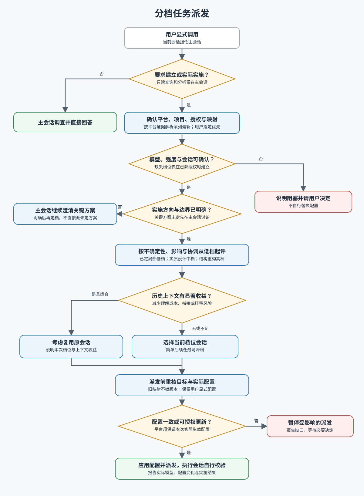

# 分档任务派发

用户显式调用后，保留当前会话作为主会话。主会话直接完成讨论、资料查询、代码只读调查、盘点、解释和分析，即使需要调用工具也不派发。只在用户要求建立工作方式时创建三个项目执行会话；只有实际实施、修改或落地执行任务才选档派发。主会话不实现或独立复核已派发的实施任务；执行会话独立完成实施与必要校验。主会话的模型设置保持原样。

实施任务先按**当前任务**的剩余不确定性、影响范围和协调复杂度，从当前平台低档起评：Codex 为 Luna · high → Sol · medium → Astra · low；Claude 为 Sonnet · high → Opus · medium → Fable · low。各档位使用对应系列在目标环境中最新可用的版本，依据平台真实模型 ID 与能力信息解析，用户显式配置优先；系列名不是可调用 ID。

低档用于目标、内容、行为、验收及关键实施方案已明确的局部执行；在已讨论方向内仍需实质性内容组织、语义取舍、去重、信息架构、交互展示设计或多个实现点协调时评中档，即使只改一页。高档用于通用能力抽象、结构重构和广泛依赖协调。详细派发提示不等于设计判断已完成；关键方案未定时先在主会话澄清。

再衡量关联历史是否能显著减少理解成本、衔接或迁移风险；同组件或原会话曾负责，不会自动升档或锁定原会话。简单后续任务可降档；正在执行的同一修改可为避免冲突留在原会话。不以代码量、文件数、验证需求、单页范围或同组件历史独立定档，也不为平均分配选档。方案已定的样式、文案和局部交互修复仍可用低档，明确方案后相似任务可降档。具体判断与派发模板见工作流；修订分档或模型规则时走查 [回归场景](tests/dispatch-routing.md)。

执行前阅读 [分档任务派发工作流](references/workflow.md)，其中规定授权边界、会话复用、平台档位、派发内容和停止条件。使用当前平台实际可用的项目与会话工具，并在建立、恢复及每次实际派发前核对最新可用模型、强度和持久会话能力；旧映射不锁定版本，旧会话仅在平台支持且符合已有授权时更新配置。若版本证据不明或强度不支持，停止受影响操作并报告，不猜测 ID、跨系列替换或静默回退；若在 Codex，可用 `list_projects`、`list_threads`、`create_thread`、`send_message_to_thread`、`wait_threads` / `read_thread` 完成对应步骤。工具或配置不可用时报告受阻步骤，不假装已经创建或派发，也不自行替换模型。

