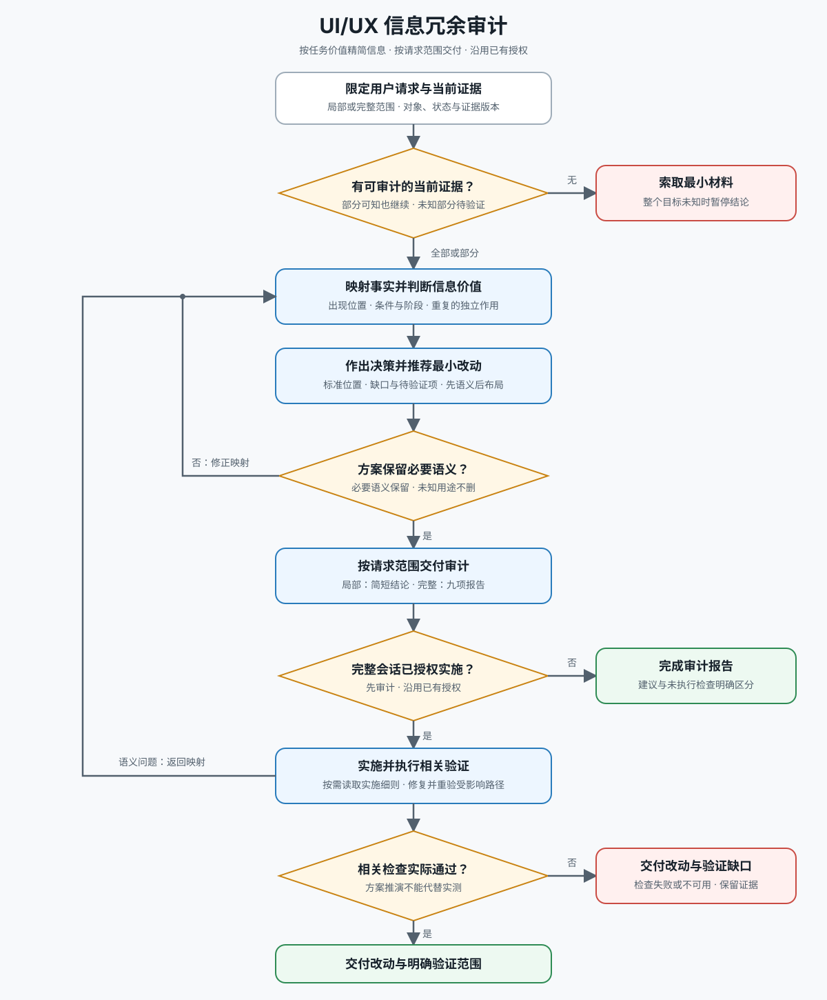

# UI/UX 重复信息审计

## 概述

先审计信息，再调整样式。把界面内容归一为事实，标出每个事实的所有出现位置，判断每次重复是否提供独立的任务价值，并提出最小安全改动。首先把信息密度视为语义问题，其次才是布局问题。

不要把某个界面变成通用视觉模板。依据当前产品或服务、使用环境、载体、媒介、感知通道、输入方式、界面结构、状态和交互语境作判断，只复用判断规则。

详细流程见 [docs/workflow.md](docs/workflow.md)，阶段概览如下：

## 输入

接受以下任意组合：

- 截图、录音、录屏、原型、设计稿、交互演示或可访问的实际界面；
- 界面文案、提示音、触觉反馈说明、对话脚本、可访问性树、视图层级、组件代码或实体控件说明；
- 用户任务、当前状态、使用环境、载体、媒介、感知通道、输入方式、尺寸和主题；
- 现有改版前后方案或问题列表。

实现资料可用时，先检查界面归属、系统约定、基础组件、Token、内容规则和当前状态，再提出修改。资料不可用时，不要虚构组件名称、媒介行为、硬件能力或 API；只索取最小缺失材料，并保持建议与具体实现无关。

## 审计门禁

完成当前状态盘点和重复信息判断前，不得新增或修改 UI、组件、区块或数据展示。不要通过直接实现来探索界面需要什么。先完成审计输出，再实现审计明确支持的改动。

## 核心流程

### 1. 盘点当前界面

记录：

- 已有组件和区块；
- 已展示的数据；
- 已存在的行动入口；
- 当前导航、窗口、屏幕与内容层级；
- 当前可感知状态、使用环境、载体、媒介、尺寸、主题和输入方式；
- 可用的实现、可访问性、截图、录音、录屏、原型或实物证据。

用符合目标界面的自然位置或交互阶段描述证据，不把网页或屏幕坐标当作默认模型。不要求代码行号、截图坐标或删除影响预测。证据不可用时标记为“待验证”，不要用假设补齐。

先确认**证据新鲜度**。存在连续改版、对话记录、旧证据或多份实现时，以目标语境中当前实际使用的界面和实现为准；把旧方案标记为历史证据或已替代方案，不要从最后一条对话直接推断最终界面。无法确认当前版本或目标语境时，明确记录证据时间和待验证项。

### 2. 明确任务与状态

记录主要用户任务、进入语境、当前状态、可用操作、约束和恢复路径。判断重复前先区分空态、加载中、就绪、活跃、待处理、成功、错误、禁用和已完成等状态；不同状态可能有意表达不同信息。

### 3. 提取信息原子

把可见、可听和可交互内容拆成事实，而不只是某种实现节点。记录身份、状态、归属、时间、数量、描述、约束、后果、操作、确认、错误、恢复和导航定位等事实。

先为事实标记角色：对象身份、当前状态、跨屏幕或跨表面识别摘要、稳定属性、环境或配置、历史或活动、操作。角色用于判断信息价值，不用于规定界面布局。

用自然语言写出每个原子的归一化事实。统一同义词、视觉编码和占位值：“已启用”“开启”和绿色圆点可能表达同一状态；时间位置中的“进行中”仍是运行状态，不是新的时间事实；数量和列表可能分别是派生事实与源数据。不要因为内容占据不同字段或组件槽位，就把它们视为不同事实。

### 4. 建立出现位置映射

对每个归一化事实，列出全部出现位置、界面位置和作用：

- 页面或屏幕标题、面包屑、导航标题、窗口标题或区块标题；
- 徽标、图标、颜色、横幅或摘要；
- 字段标签、辅助文案、提示或行内校验；
- 主次操作、确认或恢复控件；
- 弹窗、Sheet、抽屉、浮层、Popover、表格行、菜单或展开详情。

把进入当前界面的来源表面也纳入映射，例如列表卡片到详情屏幕、系统通知到应用内页面、菜单栏项目到窗口、摘要到展开内容。不要只把相同字符串视为重复证据。标记语义相同、派生摘要、视觉或听觉别名、状态占位值和彼此矛盾的表达。

### 5. 分类重复信息

使用以下类别：

- **完全重复**：同一语境中重复同一事实和表述。
- **语义重复**：不同文案或视觉编码表达同一事实。
- **派生重复**：摘要重复列表、数量或详情，但未改善扫描或比较。
- **状态重复**：徽标、横幅、图标、颜色、开关和标题重复同一状态。
- **指引重复**：描述、辅助文案、提示和警告重复同一指引。
- **操作重复**：同一操作出现多次，却没有不同的决策时机。
- **层级重复**：窗口、页面、屏幕、导航和区块标题重复同一名称，却未增加定位价值。
- **语境性重复**：同一事实出现在不同任务语境中，可能合理。

界面包含多个状态、嵌套表面、重复摘要，或叠加弹窗、窗口与流程时，读取 [references/redundancy-patterns.md](references/redundancy-patterns.md)。

### 6. 执行判断测试

依次询问每个重复事实：

1. 第二处是否回答了不同的用户问题？
2. 是否增加了约束、后果、风险、确认或恢复操作？
3. 是否维持了跨阶段、跨媒介、跨载体或跨表面的对象识别连续性？
4. 是否在局部语境中显著降低了扫描成本？
5. 如果是操作，它是否对应不同的作用域或决策时机？
6. 删除后是否会让下一步操作、当前状态或无障碍语义变得含糊？
7. 是否只是正常、默认或预期状态的再次确认，且没有安全或行动价值？
8. 是否可以缩短为语境提示，同时保留价值？

作出以下决策：

- **保留**：承担独立任务、安全或恢复作用。
- **合并**：两处信息应该组成同一个决策单元。
- **删除**：同一语境中的其他位置已完整表达该事实。
- **缩短**：当前语境需要提示，但不需要再次解释。
- **移动**：事实有效，但远离它所支持的决策。
- **拆分**：一个区块混合状态、解释和操作，导致不同作用之间互相重复。

不要为了减少页面高度、窗口面积或屏幕占用而删除业务事实。保留最靠近决策或操作的标准位置；让次要位置更短、更贴合语境。

默认态降噪采用非对称披露：正常、最新、无异常且不可行动的状态通常不追加说明；偏离预期、存在风险或可行动时才增加原因、后果或入口。安全确认、审计要求或用户明确需要确认正常状态时除外。

删除状态文字或辅助信息前，确保仍有可感知、可理解的标准表达。不要让关键状态只依赖单一视觉、听觉、触觉、空间或动作线索；精简不能破坏目标界面的可访问性名称、状态语义，以及实际输入与辅助方式下的可达操作。

### 7. 区分已验证缺口与非缺口

只有目标界面的当前证据证明信息确实缺失，并且该缺失影响用户任务时，才归为**已验证缺口**。已有内容已经覆盖需求，或提案只会增加同一事实或操作的另一种表达时，归为**非缺口**。

缺口判断必须留在重复信息审计范围内，不要扩张为开放式功能构思。

### 8. 推荐最小安全改动

先做语义改动，再做视觉改动：

1. 删除或合并重复文案和控件；
2. 集中标准状态、解释或操作；
3. 信息边界已经清楚时，移除不必要的嵌套表面；
4. 使用现有设计系统调整间距和排版；
5. 确认改动没有产生新的重复、矛盾或缺失的标准来源。

不要用 `display: none`、微小字号、低对比度、截断或折叠关键内容来掩盖语义问题。

### 9. 验证结果

对比修改前后同一使用语境、载体、媒介、输入方式和界面状态，检查：

- 用户仍能识别对象、当前状态、下一步操作、限制和恢复路径；
- 每个重复事实都有保留理由，或只剩一个标准来源；
- 弹窗、Sheet、Popover 或子窗口内容与来源界面不互相竞争；
- 可见变体没有产生矛盾或无理由的重复；
- 来源表面与目标界面的核心身份和摘要语义一致；
- 空、单条、多条、加载、活跃、等待、成功、失败和无权限等相关状态已经按目标界面的实际能力覆盖；
- 精简后的状态不只依赖单一感知线索，操作在目标界面实际支持的输入与辅助路径下仍可发现；
- 未解决的产品语义仍标记为“待验证”。

存在可验证实现时，运行与目标界面相称的最小检查，并复用现有基础组件与交互约定。不要为界面审计修改 API 契约或数据语义。

## 必须输出

实现前按以下结构交付完整审计：

1. **任务与状态**：用户目标、使用环境、载体、媒介、输入方式、状态、尺寸、主题、证据版本和缺失证据。
2. **当前状态盘点**：已有区块、已展示数据、行动入口、层级和可用证据。
3. **信息原子映射**：归一化事实、界面位置和全部出现位置。
4. **决策表**：`保留 / 合并 / 删除 / 缩短 / 移动 / 拆分`及理由。
5. **标准信息层级**：每个保留事实应该位于哪里。
6. **已验证缺口 / 非缺口**：区分影响任务的缺失与不必要的新增。
7. **不建议做什么**：会重复事实或操作、增加无决策价值的密度，或制造多个标准来源的新增与改动。
8. **最小界面改动**：先列语义修改，再列布局修改。
9. **重复信息验证**：标准事实、合理的语境性重复、状态覆盖、无障碍语义和待解决项。

重复信息决策未明确前，不要把视觉改版描述为已经完成。
