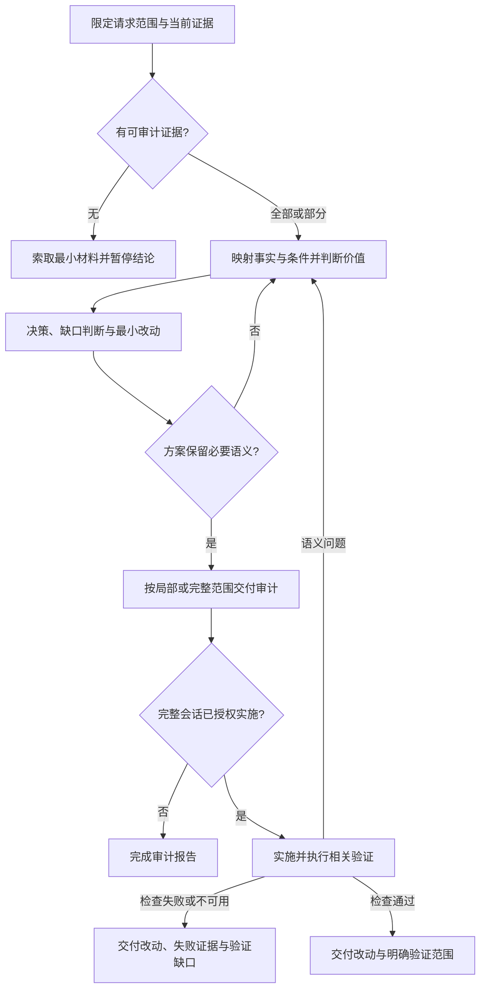

# UI/UX 信息冗余审计工作流

本文维护审计判断、交付与停止条件；入口负责按任务选择资料，`workflow.svg` 是本文的可视化投影。

## 范围与证据

接受界面截图、录音、录屏、原型、当前实现、文案、可访问性树、交互脚本或实体控件说明等有效证据，不限定产品、载体、媒介与输入方式。混合请求只审计其中的信息价值与语义部分；纯样式、逐字翻译和非语义代码修复按原请求处理，不展开本审计。

按用户指定的对象、状态或问题限定范围。检查与结论有关的当前内容、操作入口、层级、任务、约束和恢复路径，以及适用的媒介、输入与辅助方式。实现可用时按需检查相关组件、内容规则和系统约定；不为局部问题通读全项目或收集无关环境字段。

有连续改版、历史截图或多份实现时，确认目标语境正在使用的版本，给历史材料标注时间和已替代关系；不能仅凭最后一条消息推断当前界面。证据充分的部分继续，未知部分保留待验证；只有整个目标无法盘点时才索取最小材料并暂停结论。截图只能证明可见内容，不能单独证明运行行为、操作绑定或辅助路径。不要虚构缺失的组件、硬件能力、API 或产品语义。

## 信息映射与价值判断

把内容归一为自然语言事实，记录全部相关出现位置及其作用，包括有真实任务连接的来源表面。复合节点可拆成多个原子；身份、状态、数量、时间、约束、后果、操作和恢复等含义不能仅因字符串相近而合并。每条事实及出现位置须保留对象、状态、版本、配置或阶段等影响判断的条件。

同义文案、颜色和图标可能表达同一状态；时间栏中的“进行中”可能只是状态别名，数量与列表可能是派生关系。标出完全、语义、派生、状态、指引、操作、层级或语境性重复及矛盾，但不为唯一事实虚构重复类别。标题、图标、分割线、容器等不承载事实的元素也检查其识别、分组、边界或操作作用。

对所有信息判断当前任务价值：是否帮助识别对象、理解状态、决策、操作或恢复；是否增加约束、后果或风险；是否保持跨阶段、跨表面的身份连续性。重复表达还需说明独立价值，例如更易扫描、不同操作作用域、不同输入方式或决策时机。前一阶段有用不意味着应贯穿流程，条件变化时联动核对身份、描述、状态及操作，保留后续仍需用的信息。

多状态、跨表面、条件变化、摘要与详情，或装饰与操作难以区分时，按相关小节读取 [模式与示例](../references/redundancy-patterns.md)。简单局部问题不默认加载整份参考，也不把示例当作通用布局模板。

## 决策与最小改动

| 决策 | 依据 |
| --- | --- |
| 保留 | 有独立任务、安全、识别或恢复价值 |
| 合并 | 应组成同一决策单元，且合并后保留必要语义与能力 |
| 删除 | 同一语境已有完整表达，或当前证据证明此项无必要价值；说明剩余承载位置或非必要性依据 |
| 缩短 | 仍需语境提示，但无需重复解释 |
| 移动 | 信息有效，当前位置远离相关决策或操作 |
| 拆分 | 复合内容混合不同状态、解释或操作，妨碍理解 |

用途未明时保留待验证，不能把“不理解”当作“不必要”。唯一事实也可以有依据地删除，不必编造重复来源。保留内容放在最靠近相关决策或操作的标准位置；其他位置只保留有独立价值的表达。

正常、最新、无异常且不可行动的状态通常无需再加说明；异常、风险或可行动时增加原因、后果或入口。安全确认、审计要求及用户当前需要确认正常状态时除外。精简不得损害必要业务、安全、恢复和无障碍语义；关键状态仍须可感知、可理解，不能仅依赖单一视觉、听觉、触觉、空间或动作线索。操作入口保留可发现性、可访问名称和目标实际支持的输入与辅助路径。

仅当当前证据证明信息缺失且影响任务时，才列为已验证缺口；已有覆盖或只会重复表达的提案是非缺口；无法判断覆盖情况则是待验证项。未观察到不等于不存在，不把审计扩张为开放式功能构思。

先解决信息语义与标准来源，再按需要减少无作用的结构边界、使用现有设计系统调整间距和排版。不要用隐藏、微小字号、低对比度、截断或折叠关键内容来掩盖语义问题，不改 API 契约或数据语义。

## 交付规模

交付须让相关事实、出现位置、决策理由、最小改动及证据边界可复核；详略由请求决定，不机械填充空项。

- **局部审查**：针对指定问题，用短段落或小表交代相关事实与位置、决策及理由、建议改动和必要的待验证项。无需额外罗列九个标题、无关尺寸主题或不存在的缺口。
- **完整审计**：用户要求全面审查、完整报告或指定九项格式时，交付以下结构；各项只写与目标有关的内容。

1. **任务与状态**：目标、相关语境、证据版本与缺失证据。
2. **当前状态盘点**：区块、数据、操作入口与层级。
3. **信息原子映射**：事实、出现位置、作用、适用条件与保留阶段。
4. **决策表**：逐项决策及理由。
5. **标准信息层级**：保留事实的承载位置。
6. **已验证缺口 / 非缺口**：有依据的判断及单列的待验证项。
7. **不建议做什么**：会新增无价值重复、密度或多个标准来源的改动。
8. **最小界面改动**：语义修改在先，必要的布局修改在后。
9. **重复信息验证**：方案核对、实际检查状态及未解决项。

## 授权、完成与恢复

信息映射与价值决策明确后才修改界面；先向用户交代与范围相称的审计结论。只审查时交付建议并标明未执行的检查。完整会话已授权实施时，在同一任务中继续，只实施审计支持且证据充分的改动，不把审计交付当作新的确认门槛。

实施前核对方案是否保留必要事实、适用条件、后续阶段和操作能力；发现矛盾或缺失时回到映射修正，方案推演不能写成实测通过。需要实施时再读取 [实施与验证](../references/implementation.md)，完成相关修改、检查和范围内修复。

实施后发现语义问题则修正映射与改动，重验受影响路径；工具不可用或检查失败时交付实际改动、证据和验证缺口，不能宣称整体通过。最终清楚区分建议、实际修改、已执行检查和未验证范围。

