# UI/UX 重复信息审计流程

本图记录完整审计的详细执行流程。判断规则与必须输出以 `SKILL.md` 为事实来源。阶段发生变化时，同步更新本 Mermaid 图和 [workflow.svg](workflow.svg)。SVG 是流程图的唯一视觉交付物，用于文档嵌入与矢量导出。

```mermaid
flowchart TD
    START([开始完整审计])
    INPUT[收集截图、可访问页面、文案、DOM 或代码<br/>以及任务语境、状态、视口和主题]
    EVIDENCE{证据足以盘点当前页面吗？}
    REQUEST[索取最小缺失材料<br/>不可用证据标记为待验证]

    subgraph DISCOVER[阶段 1 · 盘点当前状态]
        INVENTORY[盘点已有区块、组件、展示数据、行动入口和页面层级]
        CONTEXT[记录主要任务、进入语境、状态、约束、操作和恢复路径]
        POSITION[把证据绑定到人能理解的页面位置]
    end

    subgraph NORMALIZE[阶段 2 · 归一化可见信息]
        ATOMS[提取身份、状态、时间、数量、描述、约束、后果、操作和恢复事实]
        MAP[映射每个完全、语义、派生和视觉出现位置]
        CONTRADICTION[标记视觉别名、派生摘要和矛盾表达]
    end

    subgraph DECIDE[阶段 3 · 判断每处重复]
        CLASSIFY[分类完全、语义、派生、状态、指引、操作、层级或语境性重复]
        Q1{另一处是否回答不同的用户问题？}
        Q2{是否增加约束、后果、风险、确认或恢复路径？}
        Q3{是否显著改善局部扫描？}
        Q4{删除后是否会让状态或下一步操作变得含糊？}
        Q5{能否缩短为语境提示并保留价值？}
        KEEP[保留]
        SHORTEN[缩短]
        EDIT[选择合并、删除、移动或拆分]
        CANONICAL[指定最靠近决策或操作的标准位置]
    end

    subgraph GAPS[阶段 4 · 区分缺口与新增]
        GAPQ{信息是否缺失并影响当前任务？}
        VERIFIED[已验证缺口]
        NOTGAP[非缺口<br/>已有内容覆盖或只增加另一种表达]
        BOUNDARY[把缺口判断限制在重复信息审计范围]
    end

    subgraph RECOMMEND[阶段 5 · 推荐最小安全改动]
        SEMANTIC[删除或合并重复文案与控件]
        CONSOLIDATE[集中标准状态、解释和操作]
        STRUCTURE[只移除不必要的信息边界]
        VISUAL[完成语义决策后调整间距和排版]
        DONT[记录不建议新增或修改的内容]
    end

    subgraph VERIFY[阶段 6 · 验证与交付]
        CHECK[对比修改前后的同一页面状态]
        VALID{标准事实仍清晰，且没有新增重复或矛盾吗？}
        OUTPUT[输出盘点、信息原子、决策、标准层级、缺口、非缺口、不建议项和最小改动]
        IMPLEMENT{用户是否要求实现？}
        APPLY[只实现审计支持的改动]
        END([审计完成])
    end

    START --> INPUT --> EVIDENCE
    EVIDENCE -- 否 --> REQUEST --> INPUT
    EVIDENCE -- 是 --> INVENTORY --> CONTEXT --> POSITION
    POSITION --> ATOMS --> MAP --> CONTRADICTION --> CLASSIFY --> Q1

    Q1 -- 是 --> KEEP
    Q1 -- 否 --> Q2
    Q2 -- 是 --> KEEP
    Q2 -- 否 --> Q3
    Q3 -- 是 --> KEEP
    Q3 -- 否 --> Q4
    Q4 -- 是 --> KEEP
    Q4 -- 否 --> Q5
    Q5 -- 是 --> SHORTEN
    Q5 -- 否 --> EDIT
    KEEP --> CANONICAL
    SHORTEN --> CANONICAL
    EDIT --> CANONICAL

    CANONICAL --> GAPQ
    GAPQ -- 是 --> VERIFIED --> BOUNDARY
    GAPQ -- 否 --> NOTGAP --> BOUNDARY
    BOUNDARY --> SEMANTIC --> CONSOLIDATE --> STRUCTURE --> VISUAL --> DONT
    DONT --> CHECK --> VALID
    VALID -- 否 --> MAP
    VALID -- 是 --> OUTPUT --> IMPLEMENT
    IMPLEMENT -- 是 --> APPLY --> END
    IMPLEMENT -- 否 --> END
```

实施门禁是单向的：完成当前状态盘点和重复信息决策前，不得新增或修改 UI、组件、区块或数据展示。验证发现新的重复、矛盾或缺失的标准来源时，返回出现位置映射，不要用样式掩盖问题。
