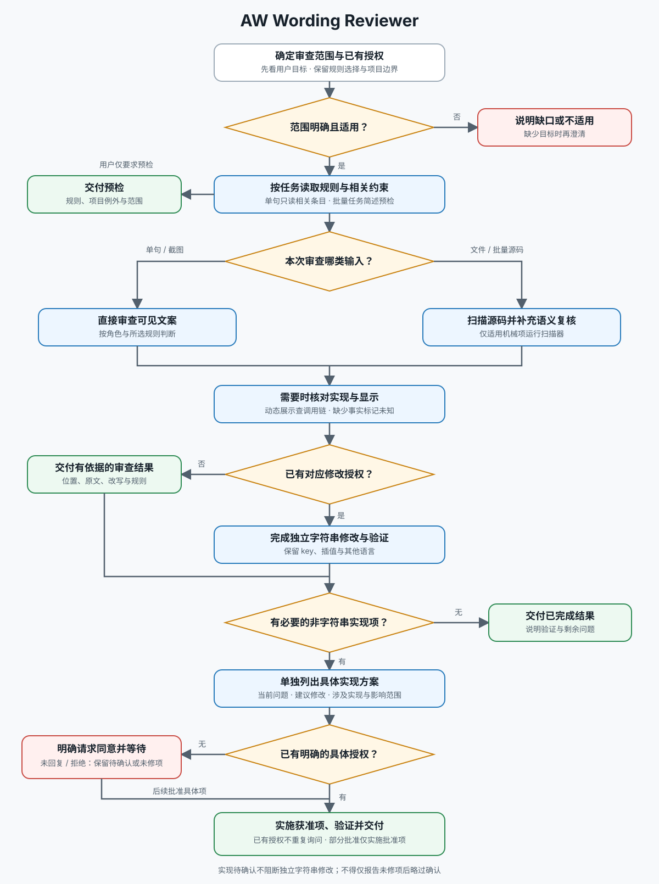

# AW Wording Reviewer

审查简体中文 UI 文案，给出有位置、规则依据和完整改写的结论。默认只审查；用户已要求修改时，完成指定范围内的改动与相关验证，不重复索取已有授权。

## 入口与资料选择

先按 [文本工作流](docs/workflow.md) 确定范围与完成条件，再按下表读取所需资料。工作流是执行事实源；不默认完整读取规则集、所有项目文档或时间实现。

| 本次任务 | 所需资料 |
| --- | --- |
| 单句、粘贴片段或截图 | [规则索引](references/rules.md#按任务查找)及对应角色条目，直接审查可见文案 |
| 指定规则、文件或批量中文词条 | 对应规则章节；源码扫描时读 [扫描器用法](references/scanner.md)，收集目标范围适用的项目约束 |
| 时间、周期或跨组件展示 | 规则集 D / H 的相关条目；时间审查或接入时读 [时间审查与接入](references/time-integration.md)，动态计算或接入才需读取实现 |

规则与例外集中在 [references/rules.md](references/rules.md)，通过编号或语义词定位。品牌、免空格专有名词和同义词的三张对照表由对应条目链接，按需读取，不在入口重复列举规则细节。

## 共同边界

- 用户显式要求 > 项目成文约定 > 内置默认规则。只选部分规则时，机械与语义复核都限于所选范围；没有项目背景时不能声称核对过项目约定。
- 内置的标点、术语、时间与数据展示标准是本 Skill 的具体约定，不能以通用写作习惯替代。需要产品事实才能裁定的内容标记待确认，不编造错误原因、保留内容或恢复动作。
- 机械零命中不代表完整通过。源码、语义、调用链和实际渲染分别以真实证据支持；未执行的检查不能宣称通过。
- 修改保留 i18n key、插值与其他语言。仅审查或仅改字符串不包含新增格式化器；时间接入授权和验证按专项文档执行。

