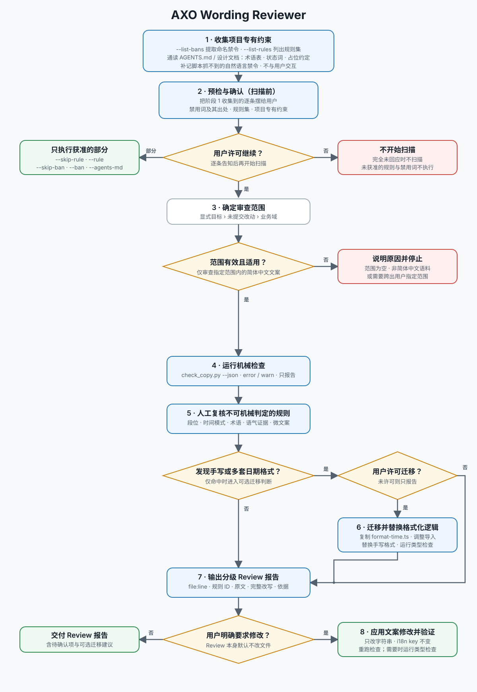

# AXO Wording Reviewer

## 目标

审查简体中文 UI 文案，产出带 `file:line`、规则依据和逐字改写建议的报告。默认只审查不修改；用户明确要求时才动文件。

本 SKILL 与具体项目无关：通用规则和日期格式契约都内置在 SKILL 里，项目专有的命名禁令与术语表从目标项目自己的文档读取。

不要凭通用中文写作经验下判断，几条容易想当然的规则：

- 引号统一用 `「」`，`《》` 只用于协议政策。
- 三张对照表在 references 下：[name-casing.csv](references/name-casing.csv) 品牌与产品实体名写法、[proper-nouns.csv](references/proper-nouns.csv) 免空格的专有名词、[terms.csv](references/terms.csv) 同义词收敛。改表即生效，不改脚本。
- 句末句号按**停顿数**判定：短句（`，``；` ≤ 1 处）不加，两处以上停顿的成句用 `。` 收尾。
- `年` 作内容词时照样加空格（`2026 年度报告`）；「日期除外」只指 `2026-07-31` 与 `14:30` 这两种格式化产物的内部。
- 省略号固定写作三个半角点 `...`，标记会进入下一步交互的动作或进行中的状态；单个 `…` 是半个省略号，不使用。

## 开始前

1. 读 [文本工作流](docs/workflow.md)，它是执行事实源。
2. 读 [references/rules.md](references/rules.md) 的完整规则集。
3. 先**收集项目专有约束**（工作流阶段 1），再**预检与确认**（阶段 2）：把收集到的东西完整告知用户，取得许可后才确定范围并开始扫描。

## 先收集，再确认，然后才扫描

### 阶段 1：收集项目专有约束

不与用户交互，只把项目侧信息取全。粗定位仓库根即可，精确范围留到确定范围时再定。

```bash
python3 <本 SKILL 目录>/scripts/check_copy.py <项目路径> --list-bans   # 从项目文档提取命名禁令
python3 <本 SKILL 目录>/scripts/check_copy.py --list-rules             # 将启用的规则集
```

同时通读 `AGENTS.md` / `CLAUDE.md` / 设计文档，登记术语表、状态词集合、占位数据约定与语气规范，并补记脚本抓不到的自然语言禁令。项目没有任何成文约束时不停止，记为「无项目专有约束」，只按通用规则审查。

### 阶段 2：预检与确认

把阶段 1 收集到的东西逐条摆给用户：抓到哪些文案禁用词及其出处、哪些禁令因只约束代码命名被跳过、补记了哪些脚本没抓到的禁令、会启用哪些规则、登记了哪些项目专有约束（没有就明说）。**取得许可后再继续。**

**用户可以选择性执行**，把选择落到参数上：

| 用户的选择 | 参数 |
| --- | --- |
| 不查某条规则 | `--skip-rule <ID>` |
| 只查某几条规则 | `--rule <ID>` |
| 排除误提取的禁用词 | `--skip-ban <TERM>` |
| 补一个没抓到的禁用词 | `--ban <TERM>` |
| 禁令来源抓错 | `--agents-md <文件>` 或 `--no-agents-md` |

只许可一部分时，只执行获准的部分，不扩大到未获准的规则与禁用词；完全未回应时不开始扫描。



## 两层审查，缺一不可

### 第一层：机械检查

取得许可并确定范围后，在**目标仓库根目录**下运行，脚本按本 SKILL 目录的绝对路径调用（本 SKILL 全局安装，cwd 不在 SKILL 目录）：

```bash
python3 <本 SKILL 目录>/scripts/check_copy.py <范围路径> --json [用户选择的 --skip-rule / --skip-ban 等]
```

按阶段 2 获准的规则与禁用词运行。完整规则集覆盖 18 条可机械判定的规则：混排空格 A1–A3、分隔符 B1–B3、标点 C1–C6、日期 D1、空值 D5、名称写法 E1、拟人化 F1、人称代词 F3、占位符 G8，外加从项目文档动态注入的命名禁令。脚本只报告不改文件，有 `error` 时退出码为 1。

它只提取含中日韩字符的字符串字面量与标记文本，并自动排除：整行注释、`console.*` / `logger.*` 日志、模板与 i18n 插值、URL、文件名、CSV 数据行、内嵌脚本片段，以及官方写法即中英连写的专有名词。

**多语言项目只检查简体中文语料**：按路径中的 i18n 标记识别语言目录，跳过其中的非简体中文语言（含繁体）。

**项目命名禁令自动提取**：脚本从被扫描路径向上查找 `AGENTS.md` / `CLAUDE.md` / `AGENTS.design.md`，识别「不允许出现 X」这类句式并扫描全部文案，拉丁词大小写不敏感。

禁令按**作用面**分流：句子里出现「工程代码」「标识符」「变量」「文件名」这类信号且没有「文案」「界面」信号的，只约束代码命名，不参与文案扫描——`--list-bans` 会单独列出它们，用户要审时用 `--ban <TERM>` 提回来。

提取是启发式的，还会跳过代码约束（`useContext`）与范畴描述（「禁止使用炒作话术」），也可能漏掉自然语言表述的禁令——这些都在阶段 1 通读文档时补记、阶段 2 提给用户。

改动脚本后先跑 `python3 <本 SKILL 目录>/scripts/check_copy.py --self-check`。

### 第二层：人工复核

脚本零命中不等于通过。以下规则族无法机械判定，必须逐条读文案：

| 规则 | 要点 |
| --- | --- |
| B4 / B5 拼接 | ` · ` 链最多 3 段；拼接前 `filter(Boolean)`，不产生空段与悬挂点 |
| C6 `description` | 说明性文案的成句与否要读语义，脚本不判，逐条看 |
| D2 时间模式 | relative / absolute / hybrid 按用户任务选；同一信息流不混用 |
| E1 表外名称 | name-casing.csv 只是参考，表外的品牌与实体名照样要逐个看 |
| E2 术语 | 收敛到哪个词见 terms.csv；项目有术语表时以项目为准，接近时交用户裁定 |
| F2 / F3 语气与人称 | 紧凑理性的陈述句；产品不自称「我们」，不用「它」指代对象 |
| G1–G9 微文案 | 按钮、确认弹窗、空状态两语域、错误、toast、占位符、标题的句式 |

裁定不了的措辞以产品规格为准；查不到就标记为待确认，不要编造。

## 日期时间：内置契约与可选迁移

日期格式的事实源是本 SKILL 内置的 [assets/format-time.ts](assets/format-time.ts)，审查时按它判定，**不需要读目标项目的实现**，也不因项目缺少格式化器而无法审查。

该文件无依赖、无框架绑定，可直接迁移进任意 TypeScript 项目。**发现目标项目在页面里手写日期格式、或存在多套格式化逻辑时**：

1. 在报告里说明现状——有哪些手写格式、分布在哪些文件。
2. **征求用户许可**后再迁移，不要擅自新增文件。
3. 获准后把 `assets/format-time.ts` 复制到项目约定的工具目录，按项目的导入风格调整路径与命名，需要其他语言时通过 `labels` 覆盖默认的中文标签。
4. 把散落的手写格式逐处替换为 `formatTimeDisplay`，并在改动后运行项目自身的类型检查。

用户未明确同意时，只报告不迁移。

## 报告

按 `error` → `warn` → 建议排序，每条给出：`file:line`、规则 ID 与级别、逐字原文、逐字改写后的完整字符串、依据出处。个人偏好不得计入 `error`。

到此即为一次完整 Review。

## 修改时的边界

仅在用户要求修改时执行，且：

- 只改文案字符串，不动组件结构、样式、类型与接口契约。
- i18n key 不变，只改 value。改简体中文后若其他语言同 key 语义随之变化，说明即可，不代译。
- 改完重跑 `check_copy.py` 确认新增违例为零；涉及类型化源码时运行项目自身的类型检查。
- 改动跨出用户指定的范围前，先说明原因并等确认。
