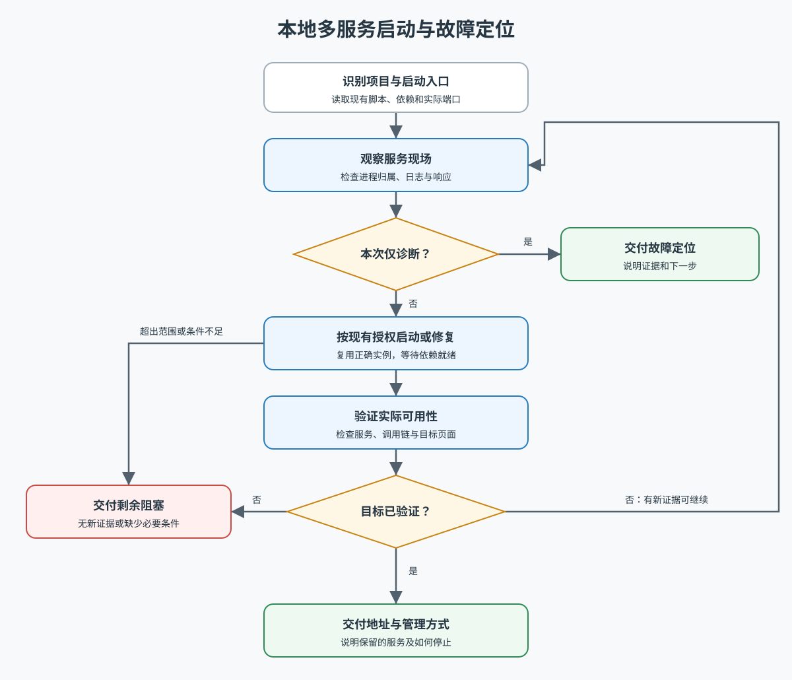

# 本地多服务启动与故障定位

让用户能实际访问目标项目，或交付明确的故障层级和阻塞条件。工具、服务、端口和运行目录从目标项目读取，不固定技术栈。

执行前读取 [本地多服务诊断工作流](docs/workflow.md)。它是执行事实源；仅在查看流程概览时读取下图：

## 关键约定

- 优先复用项目现有启动入口与正确实例。先检查端口归属和错误证据，再决定启动、重启或修复。
- 用户要求启动或修复时，继续完成范围内常规可逆操作；明确只诊断时保持只读。不要重复索取已有授权。
- 进程存在、端口开放、健康检查通过和业务页面可用是不同层次的证据；按用户目标验证，并明确没能检查的层次。
- 端口被占用不意味着可以终止该进程。只停止归属已确认且在本次范围内的目标；不批量杀进程，也不通过绕过认证或清空数据来使检查通过。
- 相同错误且没有新证据时停止重试，报告继续所需条件；一个服务受阻不妨碍其他独立诊断。

## 交付尺度

给实际地址、必要服务状态、原因和修复、验证结果与启动/停止方式。保留用户继续预览所需的服务，清理不再需要的诊断辅助进程，并交代归属。已有脚本可满足需求时不另造启动体系。
