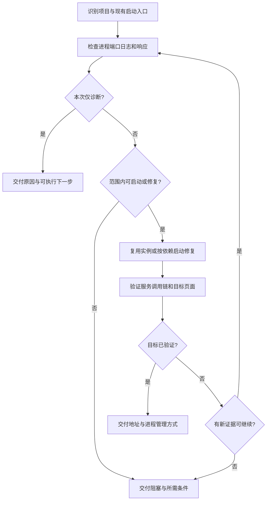

# 本地多服务诊断工作流

本文是执行事实源；`workflow.svg` 是面向人类阅读的同步概览。输入是目标项目、启动或故障描述，以及可选的启动脚本、日志和访问地址；产物是实际可用的本地服务，或有证据的故障定位与剩余阻塞。

## 1. 识别目标与动作范围

“启动/修复/打开看看”允许执行为该目标所需的本地启动、检查和常规可逆修复；“先检查/分析原因”只诊断。沿用已有授权，不把本 Skill 变成额外批准流程。

从当前目录、用户指定项目、项目说明和启动入口确定目标。优先读取现有启动脚本、包管理脚本、服务编排配置及开发文档；实际选择项目已有工具，不预设语言、操作系统、固定端口或目录。

确认必要服务的启动命令、工作目录、依赖关系、监听地址、健康检查和日志位置。只核对影响本次启动的环境配置；输出环境变量名和是否存在，避免打印令牌或完整环境文件。无法唯一确定目标时先做不依赖选择的检查，再询问具体项目。

## 2. 观察现场，区分故障层

在重复启动或修改前，检查目标进程、端口归属、近期错误和实际响应。一次建立足够的证据，不要求每个项目都运行固定命令清单。

| 观察 | 下一步判断 |
| --- | --- |
| 启动命令退出或无监听 | 检查工作目录、依赖安装、编译错误和配置缺项 |
| 地址已被占用 | 确认占用进程的命令、所属目录和用途；可能是可复用的正确实例 |
| 前端可访问但页面加载失败 | 检查静态资源、浏览器错误、代理目标和后端请求 |
| API 超时、拒绝连接或 5xx | 检查后端及必要依赖的就绪状态和同次请求日志 |
| API 返回 401/403 | 区分正常登录要求、权限问题与错误的 API/环境配置；不绕过认证 |
| 健康检查正常但业务页面失败 | 用用户目标对应的页面或只读请求继续验证 |

区分配置的端口和启动工具实际选择的端口。尤其检查自动递增端口是否让浏览器、代理或调用方继续访问旧实例。

## 3. 启动或针对证据修复

只诊断时跳到交付。需要启动时，复用已就绪且配置匹配的实例；其余服务按依赖关系启动，等待实际就绪条件再启动依赖方。若现有编排工具已处理依赖，直接使用它。

将日志放在项目惯用位置或临时目录。使用环境支持的持久进程或终端机制；记录本次启动的服务、进程/会话标识及停止方式，确认启动命令返回后服务仍可用。

修复围绕已观察原因：例如纠正工作目录或代理配置、按现有锁文件补齐依赖。不要因为一次启动失败顺便升级整套依赖、重构启动体系或清空数据。

重启前确认目标进程归属，优先正常停止。本次目标之外的未知占用进程不应被终止；可按项目约定选择空闲端口并同步本次调用链，若端口不可变且归属不明，交付阻塞并询问。不得按进程名或端口范围批量杀进程。

如果项目脚本包含数据库重置、清库、生产环境变更或其他超出本次授权的动作，先完成可独立执行的诊断，再单独说明具体动作与影响。只读取所需配置，不把完整日志、认证信息或环境文件外发。

## 4. 分层验证与有限重试

以项目已有就绪条件或合理启动时长进行有界等待。失败后先根据新日志更新假设，只有出现新证据、已作相关修复或已确认瞬态故障才重试；相同错误在无新证据时不继续重启。

按本次目标验证必要层级：

1. **服务**：监听地址属于目标实例；健康检查符合项目定义，而不只是“有进程”。
2. **调用链**：前端实际指向目标后端；所需接口响应符合预期。登录页的 200 或正常的 401 不足以证明业务链路成功。
3. **用户目标**：有浏览器能力时打开请求的页面，检查关键可见状态和必要的只读操作。没有浏览器或登录条件时明确标记尚未验证，不伪造页面可用。

涉及创建、删除或发送真实数据的业务操作，使用已有测试环境与授权范围；不要为验证启动而扩大到外部业务操作。

## 5. 交付与进程归属

交付实际访问地址、各必要服务状态、已定位原因与修复、验证结果，以及仍需解决的依赖或登录条件。多服务时用紧凑表格即可，不贴大段原始日志。

用户要继续预览时保留必要服务，给出启动/停止方式；仅为临时诊断而启动的辅助进程，在不影响交付时清理，并明确哪些进程仍在运行。不停止用户原有实例。

若缺少权限、凭据、外部依赖不可达，或相同错误没有新线索，停止相关重试，报告最小证据及继续所需条件。已有启动脚本可用时直接交付其用法；只有请求或已确认的复发缺陷需要时才修改或新建脚本。

