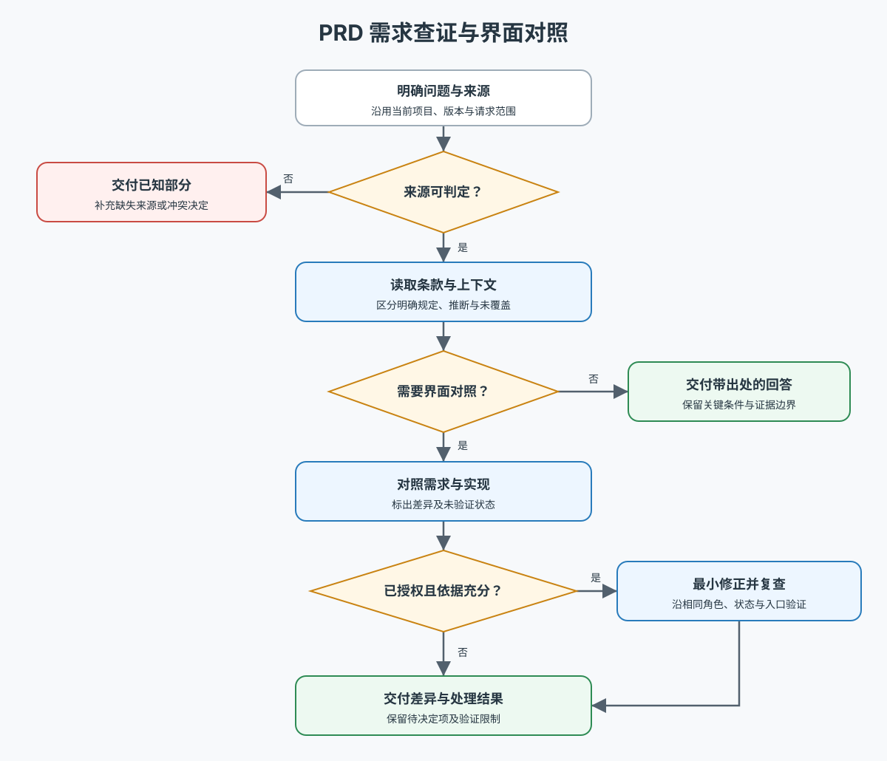

# PRD 需求查证与界面对照

将产品问题转成有出处的结论；需要对照时，把需求条款与实际页面或实现建立可核验的对应关系。

执行前读取 [PRD 查证工作流](docs/workflow.md)。它是执行事实源；仅在查看流程概览时读取下图：

## 关键约定

- 从本次项目与用户指定来源定位 PRD，不预设业务名、目录或版本。文档无法读取与文档未规定是不同结论。
- 需求依据与实现证据分别处理：代码、截图和历史回答都不能反向证明 PRD 已规定某行为。
- 保留条款的条件与例外；来源冲突按明确的适用基线判断，不凭文件较新就覆盖其他条款。
- “PRD 未覆盖”不自动等于多余功能。对照时保留未核实项，不把尚未访问的状态判为通过。
- 只查证时交付回答或差异清单；已授权修正时继续实施并复查，无需再次确认同一授权。只暂停依赖未决产品决定的部分。

## 交付尺度

简单问题给简短结论与文件/章节出处。多项对照再使用差异表；确有保存需要时将报告放在目标项目，不在本 Skill 积累项目数据。需求引入时间必须以版本历史为依据。
