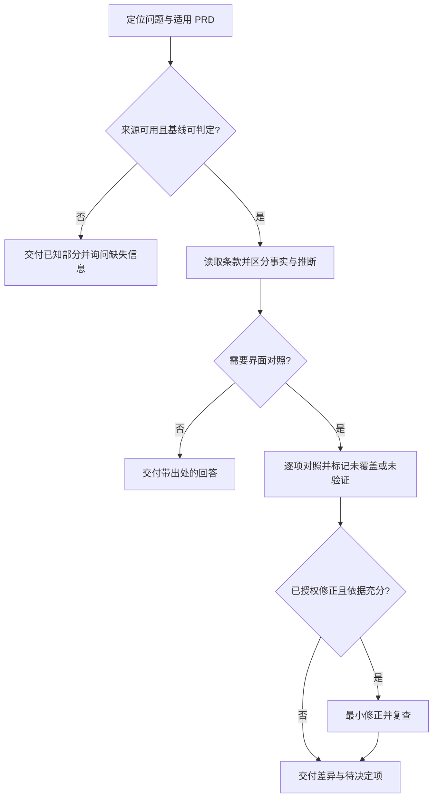

# PRD 查证工作流

本文是执行事实源；`workflow.svg` 是面向人类阅读的同步概览。输入是产品问题、可用的 PRD 来源，以及可选的待核对界面或实现；产物是带出处的回答或需求差异清单。

## 1. 确定问题和证据范围

从当前请求识别：只回答问题、核对界面/实现，还是同时实施修正。已有修改授权继续有效，不为重复确认而拆开流程。未要求修改时保持只读。

优先使用用户给出的文档、目录或链接；否则从当前项目说明、文档索引及明确关联的仓库定位 PRD。按实体与同义词检索，例如所属对象、角色权限、状态、入口和生命周期；不要为一个局部问题通读整个产品库。不得把旧会话中的目录和业务结论当作当前项目配置。

记录来源的版本、分支或适用范围，只记录实际可确认的信息。找不到文档或多个候选会改变答案时，先交付能确认的部分，再询问缺失的来源或版本。读取失败不能写成“PRD 未规定”。

## 2. 建立条款证据

读取命中条款的上下文、定义及必要的交叉引用。关键词命中不是结论；相邻对象或不同角色的规则不能混用。

对每个子问题作以下区分：

- **明确规定**：能指向适用条款，保留条件、例外与边界。
- **推断**：说明支撑条款和推理缺口，不能写成产品要求。
- **未找到规定**：说明查过的文档范围；不等于功能不存在或被禁止。
- **来源冲突**：并列冲突条款及版本。依用户指定基线或文档中明确的生效关系判定；不能仅凭文件修改时间选胜者。

代码说明当前实现，截图说明可见状态，二者不能代替 PRD 来证明需求。若用户问“何时新增”，沿目标条款检查文档提交历史或版本记录；当前文件有该条款不足以证明引入时间。

## 3. 按请求回答或对照

只回答问题时，给结论、关键条件和最近的出处；简单问题无需生成审计表或文件。

需要对照时，将 PRD 条款映射到相关页面、组件、状态或调用路径。使用实际可访问的界面、代码和运行证据；看不到的状态标为未验证。只检查用户指定范围及理解该范围必需的关联流程。

按证据区分：一致、明确要求缺失、实现与条款冲突、PRD 未覆盖的实现、尚不能核实。PRD 没提到的现有功能只能先标为“未覆盖”，不能直接判为多余并删除。名称差异先确认是否同一业务对象；角色或状态差异先确认适用条件。

## 4. 按既有授权修正并核验

若请求已授权修正，按已确认条款实施范围内最小变更，并以相同角色、状态及入口复查。不要自动把设计 Demo 接上真实后台，也不要顺便改写 PRD 来使其符合代码。

遇到无法判定的条款冲突，只暂停依赖该决定的修改；其余查证和独立修正继续。需要用户决定时，说明具体冲突及其影响。保留用户要求保留的现有功能。

## 5. 交付

回答中的出处使用本地文件链接及行号，或文档链接及章节；只引用实际读到的来源。差异较多时使用“问题/条款依据/当前实现/结论/处理”表。修改后补充验证结果和未验证部分；没有修改则不伪造验证成功。

不默认创建长期报告。用户要求保存或差异规模需要时，将结果写入目标项目合适的文档位置，不写回本 Skill。

