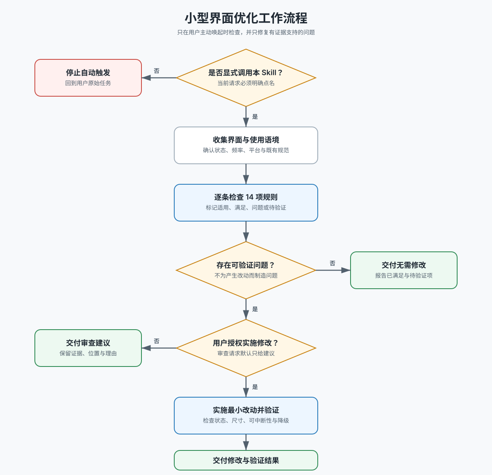

# 小型界面优化

## 调用边界

仅在用户当前请求中明确点名 `$temp-small-improves`、`temp-small-improves` 或明确要求调用本 Skill 时执行。普通的 UI 设计、前端开发、设计审查、动效优化或“让它更精致”请求都不能隐式触发本 Skill。

本 Skill 是一组聚焦的细节检查，不是完整的可用性、无障碍、视觉设计、性能或动效审计，也不替代产品既有设计系统。

执行前先读取 [文本工作流](docs/workflow.md)，再完整读取 [判断与优化规则](docs/rules.md)。原始规则网址保留在规则文档中。

## 目标

针对用户提供或指定的界面、设计稿、截图、原型或实现，逐条判断 14 项细节规则是否适用、是否已经满足，以及是否存在可验证的问题。只对命中的问题提出或实施最小改动；不要为了使用完规则而制造问题。

## 工作方式

根据用户请求中的动作决定模式：

- 用户要求“检查、审查、看看、给建议”时，只输出判断与建议，不修改文件或设计。
- 用户要求“优化、修复、调整、实现”时，可以直接实施已验证且处于授权范围内的最小改动，并做相称验证。
- 用户只显式调用 Skill、没有说明是否修改时，默认只审查。

开始判断前，先确认目标表面、主要任务、相关状态、使用频率、平台能力、既有组件和设计 Token。证据不足时把结论标记为“待验证”，不要根据规则标题猜测实现问题。

## 判断原则

对每条规则记录 `不适用 / 已满足 / 建议优化 / 待验证`：

1. 先确认规则解决的问题在当前语境中真实存在。
2. 优先复用项目已有组件、Token、动效曲线和平台惯例。
3. 数值是启发式起点，不是脱离上下文的硬编码规范；既有设计系统有明确值时优先遵循它。
4. 交互和动效改动必须保留可访问名称、键盘与触控可达性、焦点行为、状态反馈和 `prefers-reduced-motion` 或等价降级。
5. 不通过新增装饰、扩大动效范围、改写信息架构或改变业务逻辑来完成小优化。
6. 多条规则同时命中时合并为一个最小改动，避免叠加动画、重复样式或相互冲突的修复。

## 必须输出

审查模式至少交付：

- 检查范围与证据；
- 命中的规则、具体位置、当前问题和判断理由；
- 最小优化建议；
- 未命中、待验证或因既有规范而不采用的事项。

实施模式还要交付实际修改、验证结果和剩余风险。若 14 条均无可验证问题，明确报告“未发现需要修改的小型优化”，不要为了产生改动而降低标准。
